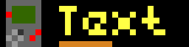

# EspHoMaTriX version 2 (EHMTXv2)

[donation-badge]:https://img.shields.io/badge/PayPal-00457C?style=for-the-badge&logo=paypal&logoColor=white
[donation-url]: https://www.paypal.com/donate/?hosted_button_id=FZDKSLQ46HJTU


[![Donate][donation-badge]][donation-url]
[](https://github.com/lubeda/EspHoMaTriXv2/actions/workflows/wiki.yaml)
[](https://github.com/lubeda/EspHoMaTriXv2/actions/workflows/main.yml)

> [!TIP]
> If you like this project, please donate a star on GitHub and consider [sponsoring](https://www.paypal.com/donate/?hosted_button_id=FZDKSLQ46HJTU) me 🙏 !

## Introduction

**EspHoMaTriXv2** is a flexible, highly customizable DIY LED Matrix display, built with a 8×32 RGB LED panel and implemented with [esphome.io](https://esphome.io)


You can control it with home assistant using service calls or by using lambda with esphome.

### How to install

For starters, I assume you use an Ulanzi TC001 pixel clock. For tinkerers and people that want more, read the [For experienced user](#for-experienced-users) part.

1. Copy all three files (ulanzi-easy.yaml, 1pixel.gif , MatrixChunky6.ttf) from the `install` folder to your esphome folder.
2. Define your secret settings (OTA password, Wi-Fi settings) in the secrets.yaml file or with the ESPHome UI.
3. Define the weekdays variable for your language (see [parameters](#parameters-reference)).
4. Install it via USB and the device should boot.


and after a while (~30 seconds) it should display the correct time.

### Overview

The base file is configured to show a clock with the day of the month over a calendar icon:


Then, you can add screens to a queue and all these screens are displayed one after another.


Each screen can display different information or animation or text, even in rainbow color. They all have a lifetime, if a screen isn't refreshed during its lifetime it will be removed from the queue. If there is nothing left in the queue, the time screen is displayed.

Some screens can show additional [display elements](#display-elements):


The `alarm` is in the upper-right corner (red)
The `rindicator` is in the lower-right corner (yellow)
The `lindicator` is in the lower-left corner (yellow)

You can [add](#normal-icon-screen)/[remove](#removing-a-screen-from-the-queue)/[emphasize](#emphasizing-a-specific-screen) screens and toggle elements from home assistant with service-calls or from esphome via lambdas in your YAML (see [API reference](#public-functionsservices)).

There are some preinstalled [icons](https://raw.githubusercontent.com/lubeda/EspHoMaTriXv2/2024.1.0/resources/default_icons.html) in the YAML, so you can easily start showing information on your display with home assistant service calls.

#### Screen types

The following screen types are available:

##### Normal icon screen

This is the regular screen, designed to show an icon and text aside.

The example below shows the icon "solar" `icon_name` with the scrolling text `text` "sun is shining" for 10 seconds `screen_time` in a queue with all the other screens in the queue; after 2 minutes of `lifetime` it disappears from the queue. The text color (`r`,`g`,`b`) is specified with RGB values. The display decides when to display this screen depending on the queue. 


Example home assistant service call:

```yaml
service: esphome.ulanzi_icon_screen
data:
  default_font: true
  icon_name: solar
  text: sun is shining
  lifetime: 2
  screen_time: 10
  r: 200
  g: 200
  b: 200
```

##### Alert icon screen

Occasionally, you have to display information immediately; this one does not have a lifetime parameter:

```yaml
service: esphome.ulanzi_alert_screen
data:
  default_font: true
  icon_name: home_assistant
  text: What a great software!
  screen_time: 10
  r: 20
  g: 180
  b: 240
```

For funny colors, there is also a service: `esphome.ulanzi_rainbow_alert_screen`

##### Rainbow icon screen

This shows the icon "solar" `icon_name` with the scrolling text `text` "sun is shining" for 10 seconds `screen_time` in a queue with all the other screens in the queue, after 2 minutes `lifetime` it disappears from the queue. The text color changes automatically. The display decides when to display this screen depending on the queue.

example home assistant service call:

```yaml
service: esphome.ulanzi_rainbow_icon_screen
data:
  default_font: true
  icon_name: solar
  text: sun is shining
  lifetime: 2
  screen_time: 10
```

##### Progress screen

To visualize e.g., a print progress you can use:



```yaml
service: esphome.ulanzi_icon_screen_progress
data:
  default_font: true
  icon_name: print3d
  text: 67% done
  progress: 67
  lifetime: 2
  screen_time: 9
  r: 200
  g: 200
  b: 200
```

A positive progress value is getting greener on its way to 100 a negative value is going to red.

##### Text-only screen


```yaml
service: esphome.ulanzi_text_screen
data:
  default_font: true
  text: What a long text
  lifetime: 2
  screen_time: 10
  r: 200
  g: 200
  b: 200
```

Same with rainbow-colored text `esphome.ulanzi_rainbow_text_screen`

##### Combined icons screen

Try this and enjoy the cool animations. 


```yaml
service: esphome.ulanzi_bitmap_stack
data:
  icons: solar,power,temp,error
  lifetime: 2
  screen_time: 10
```

##### Blank screen

Try this:

```yaml
service: esphome.ulanzi_blank_screen
data:
  lifetime: 2
  screen_time: 120
```

These were only static examples, in your automations you can customize a lot more. See the upcoming chapter for more possibilities.

#### Removing a screen from the queue

If you added e.g. an icon screen (`MODE_ICON_SCREEN` which is 5, see [modes](modes)) with icon `power`, just call:

```yaml
service: esphome.ulanzi_del_screen
data:
  icon_name: "power"
  mode: 5
```

If you want to remove a screen generated with the service: `esphome.ulanzi_blank_screen`, you can do this via:

```yaml
service: esphome.ulanzi_del_screen
data:
  icon_name: "*"
  mode: 1
```

Since a blank screen has no icon, you have to use "*" as `icon_name`.

#### Emphasizing a specific screen

To show one of the screens from the queue right now, use:

```yaml
service: esphome.ulanzi_force_screen
data:
  icon_name: "solar"
  mode: 5
```

## For experienced users

### Icons and Animations

Download and install all needed icons (.jpg/.png) and animations (.GIF) under the `ehmtxv2:` key. All icons have to be 8x8 or 8x32 pixels in size. If necessary, you can scale them with the option `resize: 8x8` or `resize: 32x8`. Pro user should use gimp.

You can also specify a URL to directly download the image file. The URLs will only be downloaded once at compile time, so there is no additional traffic on the hosting website.

All other solutions provide ready-made icons, especially Lametric has a big database of [icons](https://developer.lametric.com/icons). If you find an icon, you can use it with its ID. e.g., `lameid: 1234` Please, check the copyright of the icons you use. The maximum number of icons is limited to 90 in the code and also by the flash space and the RAM of your board.

***Sample***

```yaml
emhtx:
  icons: 
    - id: boot 
      file: icons/rocket.GIF
      duration: 75     
    - id: temp 
      lameid: 1234
    - id: yoga
      file: icons/yoga-bridge.GIF
      pingpong: true
    - id: jackshome
      url: https://awtrix.blueforcer.de/animations/JackHomePage
      resize: 32x8
    - id: garage
      lameid: 1234
      duration: 100
    - id: homeassistant
      url: https://github.com/home-assistant/assets/raw/master/logo/logo-special.png      
```

The ID of the icons is used later to configure the screens to display. So, you should name them wisely. If you like to group icons, you should prefix them, e.g., with “weather_”.

The first defined icon will be used as a fallback icon, in case of an error, e.g., if you use a non-existing icon ID.

There are some more advanced [parameters](#advanced-icon-parameter)

### Fonts

In the easy configuration is one TTF-font from [Trip5](https://github.com/trip5/Matrix-Fonts) included. 

You can configure two fonts if you like.

The font needs to be readable on a matrix display. I use a font with 6 pixels height and one with 8 Pixel height. The 6px font is my default on all screens, with a progress bar or the day of week lower line.

Some people use a “normal” font from Trip5 and another for Cyrillic, Korean or Hebrew letters. For the RTL based users, take a look at [bidi](https://github.com/idodov/bidi) from @iodov to enhance the readability.

@dbuezas has also contributed tow optimized fonts with umlauts for this kind of display `mateine.ttf` and `mateineThin.ttf` see [here](https://github.com/lubeda/EspHoMaTriXv2/issues/63).


```yaml
font:
  - file: mateine.ttf
    id: default_font
    size: 16
    glyphs:  |
      !"%()+*=,-_.:°0123456789ABCDEFGHIJKLMNOPQRSTUVWXYZ abcdefghijklmnopqrstuvwxyz€@
```

You find my first [attempt](./resources/EHMTXv2.ttf) to adapt a font also in the resources-folder. 

### Configuration

This component is highly customizable.

#### Example

```yaml
ehmtxv2:
  id: rgb8x32
  show_seconds: true
  advanced_clock: false
  matrix_component: ehmtx_display
  time_component: ehmtx_time
  icons2html: true
  iconcache: true
  default_font_id: default_font
  default_font_yoffset: 6
  special_font_id: special_font
  special_font_yoffset: 7
  brightness: 80 # percent
  time_format: "%H:%M"
  date_format: "%d.%m."
  rtl: false # write vom left to right
  vertical_scroll: false
  week_start_monday: true # false equals sunday
  scroll_count: 2 # scroll long text at least two times
  scroll_interval: 80 # milliseconds
  rainbow_interval: 32 # milliseconds
  icons: 
  .....
```

#### Parameters reference

**id** (required, ID): Manually specify the ID used for code generation and in service definitions.

**date_format** (optional, string): formats the date display with [strftime syntax](https://esphome.io/components/time.html?highlight=strftime), defaults `"%d.%m."` (use `"%m.%d."` for the US)

**show_seconds** (optional, boolean): toggle/blink an indicator-pixel each seconds while the clock is displayed (default: false)

**time_format** (optional, string): formats the date display with [strftime syntax](https://esphome.io/components/time.html?highlight=strftime), defaults `"%H:%M"` (use `"%I:%M%p"` for the US)

**default_font_yoffset** (optional, pixel): yoffset the text is aligned BASELINE_LEFT, the baseline defaults to `6`

**default_font_xoffset** (optional, pixel): xoffset the text is aligned BASELINE_LEFT, the left defaults to `1`

**special_font_yoffset** (optional, pixel): yoffset the text is aligned BASELINE_LEFT, the baseline defaults to `6`

**special_font_xoffset** (optional, pixel): xoffset the text is aligned BASELINE_LEFT, the left defaults to `1`

**scroll_small_text** (optional, boolean): normally small text is centered on the display if possible, with this set to `true` even small text is scrolled in `text_screen` and `rainbow_text_screen` (default: false)

**matrix_component** (required, ID): ID of the addressable display

**show_dow** (optional, boolean): draw the day of week rindicator on the bottom of the clock screen. Disable, e.g., if you want larger fonts, defaults to true.

**time_component** (required, ID): ID of the time component. The display shows `!t!` until the time source is valid.

**default_font** (required, ID): ID of the default font

**special_font** (required, ID): ID of the special font, you can reuse your default font, but occasionally, it's nice to have a special font to minimize scrolling

**week_start_monday** (optional, boolen): default Monday is first day of week, false => Sunday

**weekdays** (optional, string, default: "SUMOTUWETHFRSA"): Abbreviations of the days of the week, starting from Sunday, from *7 to 14* characters.

Example:
  - `weekdays: "SUMOTUWETHFRSA"`
  - `weekdays: "일월화수목금토"`
  - `weekdays: "НДПНВТСРЧТПТСБ"`
  - `weekdays: "DiLuMaMeJeVeSa" # french`

**scroll_interval** (optional, ms): the interval in ms to scroll the text (default=80), should be a multiple of the `update_interval` of [display](https://esphome.io/components/display/addressable_light.html)

**icons2html** (optional, boolean): If true, generate the HTML-file (*filename*.html) to show all included icons. (default = `false`)

**iconscache** (optional, boolean): If true, it caches icons in the `.cache\icons` folder and if it finds the specified icons in the cache, it uses them instead of trying to download them again from the Internet. (default = `false`)

#### Modes

|mode|value|
|----|----|
|MODE_BLANK| 1|
|MODE_CLOCK| 2|
|MODE_DATE| 3|
|MODE_FULL_SCREEN| 4|
|MODE_ICON_SCREEN| 5|
|MODE_TEXT_SCREEN| 6|
|MODE_RAINBOW_ICON| 7|
|MODE_RAINBOW_TEXT|8|
|MODE_RAINBOW_CLOCK| 9|
|MODE_RAINBOW_DATE| 10|
|MODE_BITMAP_SCREEN| 11|
|MODE_BITMAP_SMALL| 12|
|MODE_COLOR| 13|
|MODE_FIRE| 14|
|MODE_ICON_CLOCK| 15|
|MODE_ALERT_SCREEN| 16|
|MODE_GRAPH_SCREEN | 17|
|MODE_ICON_DATE | 18|
|MODE_ICON_PROGRESS | 19|
|MODE_RAINBOW_BITMAP_SMALL| 20|
|MODE_ICON_TEXT_SCREEN| 21|
|MODE_RAINBOW_ICON_TEXT_SCREEN| 22|
|MODE_BITMAP_STACK_SCREEN| 23|
|MODE_TEXT_PROGRESS| 24|
|MODE_PROGNOSIS_SCREEN| 25|
|MODE_RAINBOW_ALERT_SCREEN| 26|

## More details, for curious users

### Background

There are some “RGB-matrices” status displays/clocks out there, the commercial ones from LaMetric and Ulanzi, also some excellent DIY-alternatives.

- [LaMetric](https://lametric.com/en-US/) commercial ~ €199
- [Ulanzi TC001](https://www.aliexpress.com/item/1005005008682055.html) commercial ~ €50
- [AWTRIX](https://awtrixdocs.blueforcer.de/#/) (project has been discontinued after more than 4 years in August 2022)
- [PixelIt](https://github.com/pixelit-project/PixelIt) (project is under active development)
- [Pixelix](https://github.com/BlueAndi/esp-rgb-led-matrix) controlled via REST API or Websocket
- [AWTRIX-Light](https://github.com/Blueforcer/awtrix-light) From the developer of AWTRIX, optimized for the Ulanzi TC001 hardware

All the various solutions have their pros and cons. I tried some and used AWTRIX for a long time, but I found it lacking in many ways (in my opinion), so I started work on an esphome.io variant. Targeted for an optimized and extensible Home Assistant integration without paid blueprints, MQTT broker requirement, or the need to upload files to the ESP board.

> [!WARNING]
> Some updates of [esphome](https://esphome.io) will interfere with EspHoMaTriXv2, like the update of esphome to 2023.7.0. It made a change to all YAML files necessary.

### Compile errors `animation.h` is missing

```cpp
Error:
In file included from src/esphome.h:25,
                 from src/esphome/components/ehmtx/EHMTX.cpp:1:
src/esphome/components/ehmtx/EHMTX.h:6:10: fatal error: esphome/components/animation/animation.h: No such file or directory
 #include "esphome/components/animation/animation.h"
          ^~~~~~~~~~~~~~~~~~~~~~~~~~~~~~~~~~~~~~~~~~
compilation terminated.
... 
```

You have to add this to your YAML ()

```yaml
image:
   - file: 1pixel.gif
     id: breaking20237

animation:
  - file: 1pixel.gif
    id: breaking202371
```

You have also to copy the file 1pixel.gif from the **install**ation folder to the esphome directory with your YAML.

Also, there might be [breaking changes](#breaking-changes) due to a redesign of EspHoMaTriXv2.

> [!TIP]
> It is highly recommended to use an **ESP32 device**. There are conditions where the RAM size is too limited in a **ESO8266 device** so some features had to be removed for these boards (Example: bitmap_screen).

### API 

#### Home Assistant services

There are many services and parameters to use, some are only available on ESP32-platform due to resource limitations.

You can call this from, e.g., the developer tools service. [](https://my.home-assistant.io/redirect/developer_services/)


```c
  get_status
  set_display_on
  set_display_off
  hold_screen
  hide_rindicator
  hide_lindicator
  hide_gauge
  hide_alarm
  night_mode_on
  night_mode_off
  set_weekday_accent_on
  set_weekday_accent_off
  hide_icon_indicator
  show_gauge {"percent", "r", "g", "b", "bg_r", "bg_g", "bg_b"});
  show_alarm {"r", "g", "b", "size"}
  show_rindicator {"r", "g", "b", "size"}
  show_lindicator {"r", "g", "b", "size"}

  set_today_color {"r", "g", "b"}
  set_weekday_color {"r", "g", "b"}
  set_clock_color {"r", "g", "b"}
  set_text_color {"r", "g", "b"}
  set_infotext_color {"left_r", "left_g", "left_b", "right_r", "right_g", "right_b", "default_font", "y_offset"}
  expand_icon_to_9 {"mode"}

  set_solid_color {"r", "g", "b"}
  set_calendar_color {"r", "g", "b"}
    
  del_screen {"icon_name", "mode"}
  force_screen {"icon_name", "mode"}

  full_screen {"icon_name", "lifetime", "screen_time"}
  icon_screen {"icon_name", "text", "lifetime", "screen_time", "default_font", "r", "g", "b"}
  alert_screen {"icon_name","text", "screen_time", "default_font", "r", "g", "b"}
  rainbow_alert_screen {"icon_name","text", "screen_time", "default_font"}
  icon_clock {"icon_name", "lifetime", "screen_time", "default_font", "r", "g", "b"}
  icon_date {"icon_name", "lifetime", "screen_time", "default_font", "r", "g", "b"}
  
  graph_screen {"lifetime", "screen_time"}
  icon_graph_screen {"icon_name", "lifetime", "screen_time"}
  
  rainbow_icon_screen {"icon_name", "text", "lifetime", "screen_time", "default_font"}

  icon_text_screen {"icon_name", "text", "lifetime", "screen_time", "default_font", "r", "g", "b"}
  rainbow_icon_text_screen {"icon_name", "text", "lifetime", "screen_time", "default_font"}

  text_screen {"text", "lifetime", "screen_time", "default_font", "r", "g", "b"}
  rainbow_text_screen {"text", "lifetime", "screen_time", "default_font"}

  clock_screen {"lifetime", "screen_time", "default_font", "r", "g", "b"}

  rainbow_clock_screen {"lifetime", "screen_time", "default_font"}

  date_screen {"lifetime", "screen_time", "default_font", "r", "g", "b"}
  rainbow_date_screen {"lifetime", "screen_time", "default_font"}

  blank_screen {"lifetime", "screen_time"}
  color_screen {"lifetime", "screen_time", "r", "g", "b"}

  brightness {"value"}

  color_gauge {"colors"}
  bitmap_screen {"icon", "lifetime", "screen_time"}
  bitmap_small {"icon", "text", "lifetime", "screen_time", "default_font", "r", "g", "b"}
  rainbow_bitmap_small {"icon", "text", "lifetime", "screen_time", "default_font"}
  bitmap_stack {"icons", "lifetime", "screen_time"}

  show_icon_indicator {"r", "g", "b", "size", "pos", "height"}
  
  fire_screen {"lifetime", "screen_time"}

  set_clock_infotext_color {"left_r", "left_g", "left_b", "right_r", "right_g", "right_b", "default_font", "y_offset"}
  set_date_infotext_color {"left_r", "left_g", "left_b", "right_r", "right_g", "right_b", "default_font", "y_offset"}
  set_adv_clock_color {"hr", "hg", "hb", "mr", "mg", "mb", "sr", "sg", "sb"}

  text_screen_progress {"text", "value", "progress", "lifetime", "screen_time", "default_font", "value_color_as_progress", "r", "g", "b"}
  icon_screen_progress {"icon_name", "text", "progress", "lifetime", "screen_time", "default_font", "r", "g", "b"}
  set_progressbar_color {"icon_name", "mode", "r", "g", "b", "bg_r", "bg_g", "bg_b"}

  icon_prognosis_screen {"icon_name", "text", "prognosis", "lifetime", "screen_time", "default_font"}
  icon_prognosis_screen_rgb {"icon_name", "text", "prognosis", "lifetime", "screen_time", "default_font", "r", "g", "b"}
```

>[hint]
>The rainbow_* variants don't display the day of week bar.

#### Lambda

You can use the above functions also in [lambdas](https://esphome.io/guides/automations.html?highlight=lambda#lambda-action) in your esphome YAML.

all parameters have a default value.

```c
void clock_screen(int lifetime=D_LIFETIME, int screen_time=D_SCREEN_TIME,bool default_font=true,int r=C_RED, int g=C_GREEN, int b=C_BLUE);
void rainbow_clock_screen(int lifetime=D_LIFETIME, int screen_time=D_SCREEN_TIME, bool default_font=true);
void date_screen(int lifetime=D_LIFETIME, int screen_time=D_SCREEN_TIME,bool default_font=true, int r=C_RED, int g=C_GREEN, int b=C_BLUE);     
```

#### Icon screen


##### Service via API

```c
icon_screen => {"icon_name", "text", "lifetime", "screen_time", "default_font", "r", "g", "b"}
rainbow_icon_screen => {"icon_name", "text", "lifetime", "screen_time", "default_font"}
alert_screen => {"icon_name","text", "screen_time", "default_font", "r", "g", "b"}
```

##### Lambda

```c
void icon_screen(std::string icon, std::string text, int lifetime=D_LIFETIME, int screen_time=D_SCREEN_TIME,bool default_font=true,int r=C_RED, int g=C_GREEN, int b=C_BLUE);
void rainbow_icon_screen(std::string icon, std::string text, int lifetime=D_LIFETIME, int screen_time=D_SCREEN_TIME,bool default_font=true);
void alert_screen(std::string icon_name, std::string text, int screen_time, bool default_font, int r, int g, int b)
```

`icon_screen` and `rainbow_icon_screen` are in the queue for `lifetime` minutes. `alert_screen` and `rainbow_alert_screen` is displayed once, immediately for at least `screentime` seconds. For long text, the screentime is calculated automagically.

#### Full_screen

For 8x32 icons or animations


##### Service via API

```c
full_screen => {"icon_name", "lifetime", "screen_time"}
```

##### Lambda

```c
void full_screen(string iconname, int =D_LIFETIME, int screen_time=D_SCREEN_TIME);
```

#### Icon clock

display the clock with an icon. the time format an the show_dow are the same as the normal clock. take care of the font size, the time should not need more then 23 pixels width.

##### Service via API

```c
icon_clock => {"icon_name", "lifetime", "screen_time", "default_font", "r", "g", "b"});
```

##### Lambda

```c
void icon_clock(std::string iconname, int lifetime, int screen_time, bool default_font, int r, int g, int b)
```

#### Bitmap screen

> [!WARNING]
> This feature is only available on ESP32 platform !!!

For 8x32 images as text. You can generate these images with, e.g., [Pixel Bitmap Creator (8x32)](https://pixelit.bastelbunker.de/PixelCreator) or just open [bitmap-convert.html](./resources/bitmap-convert.html) (in the resources-folder) in your browser and select the images you want. For good results, the images should have a ratio of 4x1 or 1x1 to look good on your display. For better results, you could add black borders as needed to your image.

##### Service via API

```c
bitmap_screen => {"[0,4523,0,2342,0,..... (256 values 16bit values rgb565)]", "lifetime", "screen_time"}
```

##### Lambda

```c
void bitmap_screen(string text, int =D_LIFETIME, int screen_time=D_SCREEN_TIME);
```

#### Display Elements

##### Alarm

The alarm is displayed in the upper-right corner on all screen types! You can set its color and its size.

###### Home Assistant Service

```c
show_alarm => { "r", "g", "b","size"}
```

To remove it, call:
```c
hide_alarm => no parameter
```

###### Lambda

```c
void EHMTX::show_alarm(int r, int g, int b, int size=2);
```

r, g, b: 0-255 color components
size: **0-3** (zero turns it off)

To remove it, call:

```c
void hide_alarm();
```

##### rindicator

The rindicator is in the lower-left corner, but not displayed in full screen 8x32 animations. You can set its color.

###### Home Assistant Service

```c
show_rindicator => { "r", "g", "b","size"}
```

To remove it, call:

```c
hide_rindicator => no parameter
```

###### Lambda

```c
void show_rindicator(int r, int g, int ,int size=3);
```

r, g, b: 0-255 color components
size: **0-3** (zero turns it off)

To remove it, call:

```c
void hide_rindicator();
```

##### lindicator

Same as above but in the lower-left corner, this is not visible while icons are displayed.

##### gauge

The gauge is displayed in the left most column. You can set its color and its value from 0-100, the resolution is limited to 8 pixels, so it is not a precision gauge.

###### Home Assistant Service

```c
show_gauge => {"value","r", "g", "b","bg_r", "bg_g", "bg_b"}
```

To remove it, call:

```c
hide_gauge => no parameter
```

###### Lambda

```c
void show_gauge(int percent, int r, int g, int b, int bg_r, int bg_g, int bg_b);
```

percent: 0-100 (resolution: one pixel per 12.5%)
r, g, b: 0-255 foreground color components
bg_r, bg_g, bg_b: 0-255 background color components

To remove it, call:

```c
void hide_gauge();
```

#### Installation of **EspHoMaTriXv2** custom component

**EspHoMaTriXv2** is a custom component, you have to include it in your YAML configuration. To always use the newest features, you should use the repo, to use a stable version, you copy a working version to your esphome installation.

##### Use of local copy

If you download the components-folder from the repo and install it in your esphome you have a stable installation. But if there are new features, you won't see them. If needed, customize the YAML to your folder structure.

```yaml
external_components:
   - source:
       type: local
       path: components # e.g. /config/esphome/components
```

##### Use from repo

Use the GitHub repo as a component. Esphome refreshes the external components “only” once a day, perhaps you have to refresh it manually. In this mode, there may be breaking changes, so read the changelog and check the logs while installing the firmware.

```yaml
external_components:
  - source:
      type: git
      url: https://github.com/lubeda/EspHoMaTriXv2
      ref: stable # optional select a special branch or tag
```
>[tipp]
>Use the `ref` parameter to stay on the feature set you know. Using the `main` or other version will cause problems with breakting changes. But in case of esphome is breaking something i will always only fix the latest version.!

#### Addressable_light component

The **EspHoMaTriXv2** component requires a 8x32 pixel addressable_light, it is referenced by the ID `matrix_component`.

See the default [options](https://esphome.io/components/display/index.html)

There are some different matrices-types on the market, to adapt them to **EspHoMaTriXv2** you have to find the proper pixel mapper. If there is garbage on your display, try the other `pixel_mapper`. Here are the most common types for flexible 8x32 matrices:

##### Type 1

Common for 8x32 RGB flexible matrices.

Under the display tag, specify this pixel mapper:

```yaml
display:
  - platform: addressable_light
    .....
    pixel_mapper: |-
      if (x % 2 == 0) {
        return (x * 8) + y;
      }
      return (x * 8) + (7 - y);
    .....
```

##### Type 2 (e.g., Ulanzi TC001)

Under the display tag, specify this pixel mapper:

```yaml
display:
  - platform: addressable_light
    .....
    pixel_mapper: |-
      if (y % 2 == 0) {
        return (y * 32) + x;
      }
      return (y * 32) + (31 - x);
    .....
```

##### Type 3 (daisy-chained 8x8 panels)

```yaml
display:
  - platform: addressable_light
    .....
    pixel_mapper: |-
      return ((int) (x/8 * 64)) + x % 8 + y * 8;
    .....
```

##### How to configure the pixel_mapper

You have to configure this `lambda` under the `display:` section to use the **EspHoMaTriXv2** component

```yaml
display:
  - platform: addressable_light
    id: ehmtx_display
    .....
    lambda: |-
      id(rgb8x32)->tick();
      id(rgb8x32)->draw();
```

#### Light component

The light component is used by the `addressable_light` component and referenced by ID under `addressable_light_id:`.

To use the light component directly from home assistant, add the sample lambdas```on_turn_on``` and ```on_turn_off``` to the light component.

***Sample***

```yaml
light:
  - platform: neopixelbus
    id: ehmtx_light
    ....
    on_turn_on:
      lambda: |-
         id(ehmtx_display)->set_enabled(false);
    on_turn_off:
       lambda: |-
         id(ehmtx_display)->set_enabled(true);
```

To hide the light component in home assistant use: `internal: true`

```yaml
light:
  - platform: neopixelbus
    id: ehmtx_light
    internal: true
    ...
```

#### Time component

Since it is a clock, you need a time component, e.g., [home assistant](https://esphome.io/components/time/homeassistant.html). It is referenced by its ID under `time_component:` The display shows `!t!` until the time source is synchronized and valid.

##### ehmtxv2 component

Here are also the more advanced parameters listed

***Example***

```yaml
ehmtxv2:
  id: rgb8x32
  show_seconds: true
  advanced_clock: false
  matrix_component: ehmtx_display
  time_component: ehmtx_time
  icons2html: true
  default_font_id: default_font
  .....
```

***Parameters***

**id** (required, ID): Manually specify the ID used for code generation and in service definitions.

**date_format** (optional, string): formats the date display with [strftime syntax](https://esphome.io/components/time.html?highlight=strftime), defaults `"%d.%m."` (use `"%m.%d."` for the US)

**date_format_big** (optional, string): formats the date display with [strftime syntax](https://esphome.io/components/time.html?highlight=strftime), defaults `"%d.%m."` (use `"%m.%d."` for the US), works only in **advanced_clock** mode and sets the time format for a screen with a date without an icon

**show_seconds** (optional, boolean): toggle/blink an indicator-pixel each seconds while the clock is displayed (default: false)

**time_format** (optional, string): formats the date display with [strftime syntax](https://esphome.io/components/time.html?highlight=strftime), defaults `"%H:%M"` (use `"%I:%M%p"` for the US)

**time_format_big** (optional, string): formats the date display with [strftime syntax](https://esphome.io/components/time.html?highlight=strftime), defaults `"%H:%M:%S"`, works only in **advanced_clock** mode and sets the time format for a screen with a clock without an icon

**advanced_clock** (optional, boolean): Enables or disables advanced clock mode. (default: false) [More info](https://github.com/lubeda/EspHoMaTriXv2/issues/164)

**advanced_bitmap**  (optional, boolean): Enables or disables advanced clock mode. (default: false) [More info](#advanced-bitmap-mode)

**default_font_yoffset** (optional, pixel): yoffset the text is aligned BASELINE_LEFT, the baseline defaults to `6`

**default_font_xoffset** (optional, pixel): xoffset the text is aligned BASELINE_LEFT, the left defaults to `1`

**special_font_yoffset** (optional, pixel): yoffset the text is aligned BASELINE_LEFT, the baseline defaults to `6`

**special_font_xoffset** (optional, pixel): xoffset the text is aligned BASELINE_LEFT, the left defaults to `1`

**scroll_small_text** (optional, boolean): normally small text is centered on the display if possible, with this set to `true` even small text is scrolled in `text_screen` and `rainbow_text_screen` (default: false)

**rtl** (optional, boolean): if `true` write text (but only the scroll direction, the words, and numbers aren't changed!) from right to left (Arabic, Hebrew etc.). Default is `false`

**vertical_scroll** (optional, boolean): If true, the screen change is vertical scrolling. Default is `false`

**matrix_component** (required, ID): ID of the addressable display

**show_dow** (optional, boolean): draw the day of week rindicator on the bottom of the clock screen. Disable, e.g., if you want larger fonts, defaults to true.

**blend_steps** (optional, int): on screen transition you can blend in the new screen, a value of 16, 32, 64 works nice, defaults 0. The `blend_steps` is proportionally reduced depending on the brightness, from the maximum specified in the configuration to half its value at a brightness of 50 units. If the brightness is less than 50 units, then the blend_steps is not applied.

**time_component** (required, ID): ID of the time component. The display shows `!t!` until the time source is valid.

**default_font** (required, ID): ID of the default font

**special_font** (required, ID): ID of the special font, you can reuse your default font, but occasionally, it's nice to have a special font to minimize scrolling

**week_start_monday** (optional, boolean): default Monday is first day of week, false => Sunday

**weekdays** (optional, string, default: "SUMOTUWETHFRSA"): Abbreviations of the days of the week, starting from Sunday, from *7 to 14* characters.

Example:
  - `weekdays: "SUMOTUWETHFRSA"`
  - `weekdays: "일월화수목금토"`
  - `weekdays: "НДПНВТСРЧТПТСБ"`

**scroll_interval** (optional, ms): the interval in ms to scroll the text (default=80), should be a multiple of the `update_interval` of the [display](https://esphome.io/components/display/addressable_light.html)

**clock_interval** (optional, s): the interval in seconds to force the clock display. By default, the clock screen, if any, will be displayed according to the position in the queue. **If you set the clock_interval close to the screen_time of the clock, you will only see the clock!** (default=0)

**boot_logo** (optional, string , only on ESP32): Display a fullscreen logo defined as rgb565 array for `boot_logo_mode` 0/1 or a binary array for the other boot_logo_modes

```yaml
  boot_logo: "[0,0,0,0,0,0,0,0,0,0,0,0,0,0,0,0,0,0,0,0,0,0,0,0,0,0,0,0,0,0,0,0,0,63519,63519,63519,63519,0,0,0,0,0,0,0,0,0,0,0,0,0,0,0,0,0,0,0,0,0,0,0,0,0,0,0,0,63519,0,0,0,0,2016,0,0,0,0,0,0,0,0,0,0,31,0,0,0,0,0,0,0,0,0,63488,0,63488,0,0,0,63519,0,0,0,0,2016,2016,0,0,0,65514,0,65514,0,0,0,31,0,0,0,64512,0,0,64512,0,63488,63488,0,63488,63488,0,0,63519,63519,63519,0,0,2016,0,2016,0,65514,0,65514,0,65514,0,31,31,31,0,0,0,64512,64512,0,0,63488,63488,63488,63488,63488,0,0,63519,0,0,0,0,2016,0,2016,0,65514,0,65514,0,65514,0,0,31,0,0,0,0,64512,64512,0,0,0,63488,63488,63488,0,0,0,63519,63519,63519,63519,0,2016,0,2016,0,65514,0,65514,0,65514,0,0,0,31,31,0,64512,0,0,64512,0,0,0,63488,0,0,0,0,0,0,0,0,0,0,0,0,0,0,0,0,0,0,0,0,0,0,0,0,0,0,0,0,0,0,0,0,0,0,0]" 
```

Allows you to show a custom boot logo instead of the default animation when booting.
advanced_boot (optional, boolean, only on ESP32, Default: false) Enables advanced mode of boot logo display.
boot_logo (optional, string, only on ESP32): Mask defined as rgb565 array used to display boot logo, color is entirely ignored, output depends on boot logo display mode.

**boot_logo_mode** (optional, integer, only on ESP32, Default: 0) Mode of displaying boot logo, can take value from 0 to 7:

- 0 - Display the boot_logo with the defined colors (default)
- 1 - Display the boot_logo with the defined colors, the logo appears from the center to the sides.
- 2 - Display boot_logo in white color
- 3 - Display boot_logo in white color, the mask appears from the center to the sides.
- 4 - Display boot_logo with rainbow color
- 5 - Display boot_logo in rainbow color, the mask appears from the center to the sides
- 6 - Display boot_logo in white color, in pseudo-animation mode, this mode for true starship astronavigators.
- 7 - Display boot_logo in rainbow color, in pseudo-animation mode, this mode for true starship astronavigators.

Mode 3 is best used with the option

```yaml
display:
    auto_clear_enabled: false
```

After startup, to save memory, you can clear the array with the boot logo by calling the `boot_logo` setup function with an empty parameter.

```c++
id(rgb8x32)->set_boot_logo("");
```

`Mode 6,7` - True starship astronavigator modes.
Each element of the image mask array can take values from 0 to 255 (if the value is greater than 255, it is automatically reset to 255). 
Each pixel is output depending on the bit that is set in its value byte, for example:

- `1` - `10000000` - Will be displayed at every 1 cycle of the boot logo image output.
- `4` - `00100000` - Will be displayed at every 3 cycle of the boot logo image output.
- `255` - `11111111` - Will be displayed at each cycle of the boot logo image output.

**night_mode_screens** (optional, screen array, default [2, 3, 16]): List of screens displayed in [night mode](#night-mode).

**icon_indicator_screens** (optional, screen array, default [15, 18]): List of screens on which the [icon indicator](#icon-indicator) will be displayed.

**icons2html** (optional, boolean): If true, generate the HTML-file (*filename*.html) to show all included icons. (default = `false`)

**iconscache** (optional, boolean): If true, it caches icons in the `.cache\icons` folder and if it finds the specified icons in the cache, it uses them instead of trying to download them again from the Internet. (default = `false`)

**always_show_rl_indicators** (optional, boolean): If true, always show the r/l indicators on all screens. The default is to not show either on clock, date, full, and bitmap screens, left on icon, or if display gauge displayed. (default = `false`)

***Example output:***


### Advanced icon parameters

***Parameters***
See [icon details](#icons-and-animations)

- **frame_duration** (optional, ms): in the case of a GIF-file, the component tries to read the default interval for each frame. The default/fallback interval is 192 ms. In case you need to override the default value, set the duration per icon.
- **pingpong** (optional, boolean): in the case of a GIF-file, you can reverse the frames instead of starting from the first frame.

- **file** (Exclusive, filename): a local filename
- **url** (Exclusive, url): a URL to download the icon
- **lameid** (Exclusive, number): the ID from the LaMetric icon database

- **resize** (Optional, "8x8" or "32x8"): If the source file hasn't the right dimensions.

***Example***

```yaml
    - id: jackshome
      url: https://awtrix.blueforcer.de/animations/JackHomePage
      resize: 32x8
```

## Control your display

Numerous features are accessible with services from home assistant and lambdas that you can use in your YAML.

### Public functions/services
  
|service|parameter|result|
|---|---|---|
|`get_status`|none|write some status information to the esphome logs|
|`display_on`|none|turn display off|
|`display_off`|none|turn display on|
|`hold_screen`|none|show the screen that is currently displayed for the number of seconds longer|
|`hide_rindicator`|none|hides the rindicator|
|`hide_gauge`|none|hides the gauge|
|`hide_alarm`|none|hides the alarm|
|`night_mode_on`|none|turn [night mode](#night-mode) on|
|`night_mode_off`|none|turn [night mode](#night-mode) off|
|`show_gauge`|"percent", "r", "g", "b"|set the height of the gauge according to the percentage in the given color|
|`show_alarm`|"r", "g", "b", "size"|shows the color with the given size in the upper-right corner|
|`show_rindicator`|"r", "g", "b", "size"|shows the color with the given size in the lower-right corner|
|`set_today_color`|"r", "g", "b"|set the special color for today in the day of week line|
|`set_weekday_color`|"r", "g", "b"|set the default color in the day of week line|
|`set_clock_color`|"r", "g", "b"|set the default color of clock and date display|
|`set_solid_color`|"r", "g", "b"|set the color for solid pseudo icon|
|`set_calendar_color`|"r", "g", "b"|set the header color for calendar pseudo icon|
|`set_weekday_accent_on`|none|turns on the display of small days (accent) of the week when brightness is insufficient|
|`set_weekday_accent_off`|none|turns off the display of small days (accent) of the week when brightness is insufficient|
|`del_screen`|"icon_name", “mode”|deletes the specified icon screen from the queue, the [mode](#modes) is a filter|
|`force_screen`|"icon_name", “mode”|displays the selected the specified icon screen from the queue, the [mode](#modes) is a filter|
|`full_screen`|"icon_name", "lifetime", "screen_time"|show the specified 8x32 icon as full screen|
|`icon_screen`|"icon_name", "text", "lifetime", "screen_time", "default_font", "r", "g", "b"|show the specified icon with text|
|`rainbow_icon_screen`|"icon_name", "text", "lifetime", "screen_time", "default_font"|show the specified icon with text in rainbow color|
|`text_screen`|"text", "lifetime", "screen_time", "default_font", "r", "g", "b"|show the specified text|
|`rainbow_text_screen`|"text", "lifetime", "screen_time", "default_font"|show the specified text in rainbow colors|
|`clock_screen`|"lifetime", "screen_time", "default_font", "r", "g", "b"|show the clock|
|`rainbow_clock_screen`|"lifetime", "screen_time", "default_font"|show the clock in rainbow color|
|`blank_screen`|"lifetime", "screen_time"|"show" an empty screen|
|`date_screen`|"lifetime", "screen_time", "default_font", "r", "g", "b"|show the date|
|`brightness`|"value"|set the display brightness|
|`alert_screen`|"icon_name", "text", "screen_time", "default_font", "r", "g", "b"|show the specified icon with text, screen forced and lifetime = screen_time|
|`rainbow_alert_screen`|"icon_name", "text", "screen_time", "default_font"|show the specified icon with text in rainbow color, screen forced and lifetime = screen_time|
|`icon_screen_progress`|"icon_name", "text", "progress", "lifetime", "screen_time", "default_font", "r", "g", "b"|show the specified icon with text and with progress bar on bottom|
|`set_progressbar_color`|"icon_name", "mode", "r", "g", "b", "bg_r", "bg_g", "bg_b"|sets the specified by name and [mode](#modes) screen with progress bar, the specified color of the progress bar, and the background color of the progress bar. if you set the color to black, the color display will work according to the progress value|
|`icon_clock`|"icon_name", "lifetime", "screen_time", "default_font", "r", "g", "b"|show the specified icon with time, there is support for [displaying text on top of the icon](#icon_text)|
|`icon_date`|"icon_name", "lifetime", "screen_time", "default_font", "r", "g", "b"|show the specified icon with date, there is support for [displaying text on top of the icon](#icon_text)|
|`graph_screen`|"lifetime", "screen_time"|show graph as defined in the YAML file|
|`icon_graph_screen`|"icon_name", "lifetime", "screen_time"|show the specified icon with graph as defined in the YAML file|
|`set_infotext_color`|"left_r", "left_g", "left_b", "right_r", "right_g", "right_b","default_font","y_offset"|set the special color for left and right char on info text|
|`bitmap_small`|"icon", "text", "lifetime", "screen_time", "default_font", "r", "g", "b"|show 8x8 image as text, and text|
|`rainbow_bitmap_small`|"icon", "text", "lifetime", "screen_time", "default_font"|show 8x8 image as text, and text in rainbow colors|
|`icon_text_screen`|"icon_name", "text", "lifetime", "screen_time", "default_font", "r", "g", "b"|show the specified icon with text and scroll icon along with long text|
|`rainbow_icon_text_screen`|"icon_name", "text", "lifetime", "screen_time", "default_font"|show the specified icon with text in rainbow color and scroll icon along with long text|
|`bitmap_stack`|"icons", "lifetime", "screen_time"|show or scroll from 1 to 64 icons described in the configuration|
|`text_screen_progress`|"text", "value", "progress", "lifetime", "screen_time", "default_font", "value_color_as_progress", "r", "g", "b"|show the specified short text with value and with progress bar on bottom|
|`icon_prognosis_screen`|"icon_name", "text", "prognosis", "lifetime", "screen_time", "default_font"|show an icon, text, and a prognosis bar consisting of 24 dots of specified colors|
|`icon_prognosis_screen_rgb`|"icon_name", "text", "prognosis", "lifetime", "screen_time", "default_font", "r", "g", "b"|show an icon, text, and a prognosis bar consisting of 24 dots of specified colors|
|`set_adv_clock_color`|"hr", "hg", "hb", "mr", "mg", "mb", "sr", "sg", "sb"|available only in **advanced clock mode** `advanced_clock: true`, allows you to set the color for the Hours (hr, hg, hb), Minutes (mr, mg, mb) and Spacer (sr, sg, sb), color is set by analogy with `r,g,b`. If the color is set as `black`, the standard color is used (see `set_clock_color`).|
|`set_clock_infotext_color`|"left_r", "left_g", "left_b", "right_r", "right_g", "right_b","default_font","y_offset"|set the special color for left and right char on info text on `icon clock` screen, work only in **advanced clock mode**|
|`set_date_infotext_color`|"left_r", "left_g", "left_b", "right_r", "right_g", "right_b","default_font","y_offset"|set the special color for left and right char on info text on `icon date` screen, work only in **advanced clock mode**|
|`show_icon_indicator`|"r", "g", "b", "size", "pos", "height"|shows the line indicator in the Icons area on the specified screens, in the specified color and at the specified vertical position|
|`hide_icon_indicator`|none|hides the icon indicator|
|`expand_icon_to_9`|"mode"|Extends the icon display on the clock screen and date screen by one line (9 pixels wide). Mode 0 (default) - do not expand. Mode 1 - expand only on the clock screen. Mode 2 - expand only on the date screen. Mode 3 - expand on the screen with clock and on the screen with date. [More info](https://github.com/lubeda/EspHoMaTriXv2/pull/179)|

#### Parameter description

- **r, g, b**: Color components for red, green, and blue 0..255
- **size**: The size of the rindicator or alarm, 1-3
- **percent**: values from 0..100
- **icon_name**: the id of the icon to show, as defined in the YAML file (or pseudo-icon `blank` - empty icon, `solid` - solid icon, `calendar` - calendar icon), it is also possible to set the arbitrary [screen identifier](#screen_id), for example `icon_name|screen_id`
- **icons**: the list of id of the icon to show, as defined in the YAML file, like: icon1,icon2.
- **text**: a text message to display
- **lifetime**: how long does this screen stay in the queue (minutes)
- **screen_time**: how long is this screen display in the loop (seconds). For short text without scrolling it is shown the defined time, longer text is scrolled at least `scroll_count` times.
- **default_font**: use the default font (true) or the special font (false)
- **progress**: can take a value from -100 to 100, the color of the progress bar is calculated automatically, if no colors are specified in the function `set_progressbar_color`, then if the progress is in the range `0..100`, then `from red to green`, if in the range `-100..0`, then from `green to red`.
- **value_color_as_progress**: display the value with the color of the current color on the progress bar
- **value**: the brightness 0...255 
- **prognosis**: 24 triplets of digits (72 in total), each triplet, one point on the prognosis bar in the specified color in the triplet color. Like: [200,200,200, ..., 100,100,100] see [details](https://github.com/lubeda/EspHoMaTriXv2/issues/149)

### Night mode

When night mode is enabled, only the screens specified in `night_mode_screens` are displayed (**default:** 2, 3, 16) the other screens can be added, deleted, and will follow their life cycle but will not be displayed. Screen numbers in the table [mode](#modes).

### Icon Indicator

Shows the line indicator in the Icons area on the specified screens, in the specified color and at the specified vertical position.

```yaml
ehmtxv2:
...
  icon_indicator_screens:
    - 15
```

Home assistant service call:

```yaml
service: esphome.ulanzi_show_icon_indicator
data:
  r: 240
  g: 240
  b: 240
  size: 6
  pos: 7
  height: 1
```

### Local lambdas

#### Add screen to your display queue

You can add screens locally and display data directly from any local sensor. See this sample:

##### Lambda

Take care that the ```char text[30];``` has enough space to store the formatted text.

```yaml
sensor:
  - platform: bh1750
    id: sensorlx
    ...
    on_value:
      then:
        lambda: |-
          char text[30];
          sprintf(text,"Light: %2.1f lx", id(sensorlx).state);
          // 5 Minutes,each time at least 11 seconds,no alarm
           id(rgb8x32)->icon_screen("sun", text); // uses default values for color etc.
```

##### Force screen

Force the selected [icon_screen](#icon-screen) ```icon_name``` to be displayed next. Afterward, the loop continues from this screen. e.g., helpful for alarms. Or after an update of the value/text.

```yaml
    id(rgb8x32)->force_screen("homeassistant");
```

##### Change configuration during runtime

*Configuration variables/functions:*

Experienced programmers can use these public methods:

```c
```

### Local triggers

To use the display without home assistant automations, you may use the [advanced functionality](#change-configuration-during-runtime) with triggers. The triggers can be fired by sensors, time or by the ehmtxv2 component.

#### on_empty_queue

This trigger is called without parameters every time the queue is empty.

See the examples:

##### Show icon_screen if queue is empty

```yaml
on_empty_queue:
     then:
       lambda: |-
          id(rgb8x32)->icon_screen("error","I'm bored`);
```

#### on_start_running

This trigger is called without parameters once after the device boots.

See the examples:

##### Show only date after boot

```yaml
on_start_running:
     then:
       lambda: |-
          id(rgb8x32)->date_screen(10,5);
```

#### on_add_screen

There is a trigger available to do some local magic. The trigger ```on_add_screen``` is triggered every time a new screen with an icon is added to the queue. In lambda's you can use two local variables:

**icon** (Name of the icon, std::string): value to use in lambda

**mode** ([mode](#modes) of the screen, uint8_t): value to use in lambda

See the examples:

##### Write information to esphome log

```yaml
ehmtxv2:
  ....
    on_add_screen:
    then:  
      - logger.log:
          format: 'add screen: %s, mode: %d'
          tag: "EHMTXv2 sample"
          args:
            - icon.c_str()
            - mode
```

#### on_start_running

The trigger ```on_start_running``` is triggered when the display starts. It is triggered when time sync is done, and initial clock / date / version screens are loaded. This is to allow you to customize the default screens (for instance set colours for the clock).

#### on_icon_error

The trigger ```on_icon_error``` is triggered if you try to add a screen with a non defined icon. In lambda's you can use one local string variable:

**icon** (Name of the icon, std::string): value to use in lambda

See the examples:

```yaml
ehmtxv2:
  ....
  on_next_screen:
    lambda: |-
        ESP_LOGD("Check CONFIG","Icon_name: %s",icon.c_str());
```

#### on_next_screen

The trigger ```on_next_screen``` is triggered every time a new screen is displayed (it doesn't trigger on the clock/date display!!). In lambda's you can use two local string variables:

**icon** (Name of the icon, std::string): value to use in lambda

**text** (displayed text, std::string): value to use in lambda

See the examples:

##### Write information to esphome log

```yaml
ehmtxv2:
  ....
  on_next_screen:
    lambda: |-
        ESP_LOGD("TriggerTest","Icon_name: %s",icon.c_str());
        ESP_LOGI("TriggerTest","Text: %s",text.c_str());
```

##### Send an event to Home Assistant

To send data back to home assistant, you can use events.

```yaml
ehmtxv2:
  ....
  on_next_screen:
    - homeassistant.event:
        event: esphome.next_screen
        data_template:
          iconname: !lambda "return icon.c_str();"
          text: !lambda "return text.c_str();"
```

***Result***


#### on_next_clock

The trigger ```on_next_clock``` is triggered every time a new clock display circle starts. 
See the examples:

#### on_show_display

The trigger ```on_show_display``` is triggered when the screen is turned on or off. In lambda's you can use one local boolean variable:

**state** (Display state, boolean): value to use in lambda

#### on_night_mode

The trigger ```on_night_mode``` is triggered when the night mode is turned on or off. In lambda's you can use one local boolean variable:

**state** (Night mode state, boolean): value to use in lambda

##### Change something for each clock circle

```yaml
ehmtxv2:
  ....
  on_next_clock:
    lambda: |-
      id(rgb8x32)->.......
```

**(D)** Service **brightness**

Sets the overall brightness of the display (`0..255`)

*parameters:*

- ```brightness```: from dark to bright (`0..255`) (default = `80`) as set in the light component by ```color_correct: [30%, 30%, 30%]```

There's an easier way, by using a number component:

```yaml
number:
  - platform: template
    name: "LED brightness"
    min_value: 0
    max_value: 255
    step: 1
    lambda: |-
      return id(rgb8x32)->get_brightness();
    set_action:
      lambda: |-
        id(rgb8x32)->set_brightness(x);
```

**(D)** Service **del_screen**

Removes a screen from the display by icon name. If this screen is actually displayed while sending this command, the screen will be displayed until its "show_screen"-time has ended.

Optionally, you can suffix a * to the icon name to perform a wildcard delete, which will delete all screens beginning with the icon_name specified.

For example, if you have multiple icons named weather_sunny, weather_rain & weather_cloudy, you can issue a del_screen weather_* to remove whichever screen is currently in a slot and replace it with a new weather screen.

*Parameters:*

- ```icon_name```: Icon `id` defined in the YAML (see installation)
- ```mode```: The mode is a filter to select different screen types, e.g. use `5`for icon_screen


**(D)** Service **display_on** / **display_off**

Turns the display on or off

There's an easier way in using a switch component:

***Sample***

```yaml
switch:
  - platform: template
    name: "$devicename Display"
    icon: "mdi:power"
    restore_mode: ALWAYS_ON
    lambda: |-
      return id(rgb8x32)->show_display;
    turn_on_action:
      lambda: |-
        id(rgb8x32)->set_display_on();
    turn_off_action:
      lambda: |-
        id(rgb8x32)->set_display_off();
```

Service **skip_screen**

If there is more than one screen in the queue, it skips the actual displayed screen to the next screen.

e.g., on the Ulanzi TC001

```yaml
binary_sensor:
  - platform: gpio
    pin:
      number: $left_button_pin
      inverted: true
    on_press:
      lambda:
        id(rgb8x32)->skip_screen();
```

Service **hold_screen**

Displays the current screen for a configured amount (default=30) seconds longer.

e.g., on the Ulanzi TC001

```yaml
binary_sensor:
  - platform: gpio
    pin:
      number: $right_button_pin
      inverted: true
    on_press:
      lambda:
        id(rgb8x32)->hold_screen(120);
```

**(D)** Service **get_status**

This service displays the running queue and a list of icons in the ESPhome device logs (INFO level or above).

```log
[13:10:10][I][EHMTX:175]: status status: 1  as: 1
[13:10:10][I][EHMTX:176]: status screen count: 3
[13:10:10][I][EHMTX:181]: status slot: 0 icon: 36  text: 47.9°C end: 400
[13:10:10][I][EHMTX:181]: status slot: 1 icon: 23  text: Supa langer Text end: 310
[13:10:10][I][EHMTX:181]: status slot: 2 icon: 1  text: 10.3°C end: 363
[13:10:10][I][EHMTX:186]: status icon: 0 name: boot
[13:10:10][I][EHMTX:186]: status icon: 1 name: temp
[13:10:10][I][EHMTX:186]: status icon: 2 name: garage
[13:10:10][I][EHMTX:186]: status icon: 3 name: wind
[13:10:10][I][EHMTX:186]: status icon: 4 name: rain
```

## Advanced options

##### screen_id

Screen identifier allows you to display the same icons on the same screen type without overlapping each other, for example, weather and weather forecast:
```yaml
- service: esphome.esp_pixel_clock_icon_screen
  data:
    icon_name: "weather_{{ states('weather.current_weather') | replace('-','_') }}|weather"
...
- service: esphome.esp_pixel_clock_icon_screen
  data:
    icon_name: "weather_{{ states('weather.forecast_weather') | replace('-','_') }}|forecast"
...
```
If the screen identifier is specified, then all work on identification of the screen is carried out by it, as well as in functions like `del_screen`, `force_screen` it **will be necessary to specify it** and **not the name of the icon**.

##### icon_text

A common format for specifying output options: `icon|mode#draw_mode`
- `icon` - Icon from YAML that will be displayed
- `mode` - Mode, what will be displayed on the icon
- `draw_mode` - Mode how the text will be displayed on the icon

**mode** that are supported:
- `day` - Displays the current day of the month on the icon
- `weekday` - Displays the current day of the week on the icon 

**draw_mode** that are supported:
- 0 - default - To the edges
- 1 - To the center
- 2 - Left to center, Right to edge
- 3 - To the center, the left one is a pixel higher
- 4 - To the center, the right one is a pixel higher
- 5 - To the center, without leading 0 (**only for day**)

https://github.com/lubeda/EspHoMaTriXv2/issues/92#issuecomment-1750184472

**Example**: `calendar|day#1` - Show the `calendar` icon, display the current day of the month on it with the numbers centered.


## Integration in Home Assistant

To control your display, it has to be integrated in Home Assistant. Then it provides several services, all prefixed with the configured `devicename` e.g.,, "ehmtx". See the default services marked as **(D)** [above](#services), but you can add your own (see alarm and screen).

### Services

All communication with Home Assistant use the homeasistant-api. The services can be provided by default or also defined additionally in the YAML. To define the additional services, you need the ID of the ehmtx-component e.g. ```id(rgb8x32)```.

### Use in Home Assistant automations

The easiest way to use ehmtx as a status display is to use the icon names as trigger ID. In my example, I have an icon named “wind” when the sensor.wind_speed has a new state, this automation sends the new data to the screen with the icon named “wind” and so on.

```yaml
alias: EHMTX 8266 Test
description: ''
trigger:
  - platform: numeric_state
    entity_id: sensor.wind_speed
    id: wind
  - platform: state
    entity_id: sensor.actual_temperature
    id: temp
  - platform: state
    entity_id: sensor.wg_cover_device
    id: cover
condition: []
action:
  - service: esphome.ehmtx8266_icon_screen
    data:
      icon_name: '{{trigger.id}}'
      text: >-
        {{trigger.to_state.state}}{{trigger.to_state.attributes.unit_of_measurement}}
mode: queued
max: 10
```

## Tips

### Display sensor precision after home assistant 2023.3.0

See [templating](https://www.home-assistant.io/docs/configuration/templating/#states) for possibilities to optimize the output
e.g.
```{{ states(sensor.solarpower, rounded=True) }} kWh```

### Specific icons per condition

Add an icon per weather condition to the ehmtxv2 component

```yaml
  - id: weather_clear_night
      lameid: 52163
    - id: weather_cloudy
      lameid: 25991
    - id: weather_fog
      lameid: 52167
    ......
```

Sample automation to show the weather with local temperature

```yaml
alias: EHMTX weather
description: weather with icon per condition
trigger:
  - platform: state
    entity_id: weather.metno
action:
  - service: esphome.ulanzi_del_screen
    data:
      icon_name: weather_*
      mode: 5
  - service: esphome.ulanzi_icon_screen
    data:
      icon_name: weather_{{ trigger.to_state.state }}
      text: >-
        {{ states("sensor.external_actual_temperature") }}°C
      ....
```

or another sample automation for the trashcan type

```yaml
alias: "EHMTX Müllanzeige"
description: Anzeige welche Tonne raus muss. iconnamen gekürzt
trigger:
  - platform: time
    at:
      - "06:30"
      - "08:30"
      - "10:30"
      - "15:00"
      - "17:00"
      - "19:00"
condition:
  - condition: numeric_state
    entity_id: sensor.mulltrigger
    below: "3"
action:
  - service: esphome.ulanzi_del_screen
    data:
      icon_name: trash_*
      mode: 5
  - service: esphome.ulanzi_icon_screen
    data:
      icon_name: >-
        trash_{{ states("sensor.mulldetails") | replace("Biotonne",   "brow")|
        replace("Papiertonne","blue")| replace("Restmüll",   "grey")|
        replace("gelbe Tonne","yell|") | truncate(4,true,"")  }}     
      text: >-
        {{ states("sensor.mulldetails")|replace(" in","")|replace(" days","
        Tagen") | replace ("0 Tagen","heute") | replace ("1 Tagen","morgen")}}
      lifetime: 120
      ...
```

### Integrate into Home Assistant UI

Add entities to the Home Assistant UI for interactive control of the display

#### Brightness

```yaml
number:
  - platform: template
    name: "$devicename brightness"
    min_value: 0
    max_value: 255
    step: 1
    lambda: |-
      return id(rgb8x32)->get_brightness();
    set_action:
      lambda: |-
        id(rgb8x32)->set_brightness(x);
```

#### Display switch

```yaml
switch:
  - platform: template
    name: "$devicename Display"
    icon: "mdi:power"
    restore_mode: ALWAYS_ON
    lambda: |-
      return id(rgb8x32)->show_display;
    turn_on_action:
      lambda: |-
        id(rgb8x32)->set_display_on();
    turn_off_action:
      lambda: |-
        id(rgb8x32)->set_display_off();
```

#### Night mode switch

```yaml
switch:
  - platform: template
    name: "$devicename Night Mode"
    icon: "mdi:weather-night"
    restore_mode: ALWAYS_OFF
    lambda: |-
      return id(rgb8x32)->night_mode;
    turn_on_action:
      lambda: |-
        id(rgb8x32)->set_night_mode_on();
    turn_off_action:
      lambda: |-
        id(rgb8x32)->set_night_mode_off();
```

### automatic brightness

Awtrix and PixelIt have hard-coded functionality. EHMTX is also capable of building something like that with lambdas. You are welcome to experiment as you see fit. See the Ulanzi simple YAML as a guide.

Example: automatic brightness control with a bh1570 sensor

```yaml
sensor:
  - platform: bh1570
    # ...
    on_value:
      then:
         lambda: |-  
            if (x > 200)
            {
               id(rgb8x32)->set_brightness(50);
            } else {
               id(rgb8x32)->set_brightness(250);
            }
```

### bitmap_stack example

In the icons list (**icons**), you can pass a modifier (currently supported only **two**, works only for 1, 2, 3 icons in the list), which will change the method of displaying icons.

```
ehmtxv2:
  icons: 
    - id: skull
      lameid: 11241
```

Default icon display mode:
```
service: esphome.esp_hall_pixel_clock_bitmap_stack
data:
  icons: "skull,skull,skull"
  lifetime: 1
  screen_time: 10
```

Mode of displaying icons with **two** modifiers:
```
service: esphome.esp_hall_pixel_clock_bitmap_stack
data:
  icons: "skull,skull,skull|two"
  lifetime: 1
  screen_time: 10
```

It's easier to see what it looks like than to describe it, try both options, choose the one that suits you best.

### Advanced Bitmap mode

Enables advanced mode of Bitmap screen (MODE_BITMAP_SCREEN), allows the use of [screen identifiers](#screen_id), which in turn makes it possible to display more than one Bitmap screen on the clock. But it can also increase RAM consumption, each screen + 256 bytes.

```
ehmtxv2:
  advanced_bitmap: true
```

### Select for Expand Icon to 9

```
select:
  - platform: template
    name: "Expand icon to 9"
    optimistic: true
    options:
      - "not"
      - "clock"
      - "date"
      - "clock and date"
    restore_value: true
    on_value:
      then:
        - lambda: |-
            if (x == "not") {
              id(rgb8x32)->expand_icon_to_9(0);
            }
            else if (x == "clock"){
              id(rgb8x32)->expand_icon_to_9(1);
            }
            else if (x == "date"){
              id(rgb8x32)->expand_icon_to_9(2);
            }
            else if (x == "clock and date"){
              id(rgb8x32)->expand_icon_to_9(3);
            }
```

## Breaking changes

Please take a look at the [changelog](CHANGELOG.md) for more details also.

### 2024.1.0

- new and “clean” release

## EspHoMaTriX in the media

See this German tutorial video with information on setting up your display [RGB-LED Status Display für Home Assistant mit ESPHome | ESPHoMaTrix](https://www.youtube.com/watch?v=DTd9vAhet9A).

Another German tutorial video focused on the Ulanzi [Smarte Pixel Clock über Home Assistant steuern - Entitäten / Icons und mehr in der Ulanzi](https://www.youtube.com/watch?v=LgaT0mNbl34)

See this [nice article](https://blakadder.com/esphome-pixel-clock/) about EsphoMaTrix on a Ulanzi TC001 from [blakadder](https://github.com/blakadder).

Short video on Instagram [@blak_adder](https://www.insbuiltagram.com/reel/CpYVByRIaSI)

See these English discussions:
[Share your projects](https://community.home-assistant.io/t/esphomatrix-a-simple-clock-status-display/425325)
[ESPHOME](https://community.home-assistant.io/t/a-simple-diy-status-display-with-an-8x32-rgb-led/379051)

It was also mentioned in the blog [Building the Open Home](https://building.open-home.io/local-control-is-the-only-way/) and in the home assistant [livestream](https://youtu.be/IGnCGDaXR0M?t=6267)

Or in German:
[Showroom](https://community.simon42.com/t/8x32-pixel-uhr-mit-homeassistant-anbindung/1076)

## Disclaimer

THE SOFTWARE IS PROVIDED “AS IS”, use at your own risk!

## Special Thanks

- **[andrewjswan](https://github.com/andrewjswan)** Boot animation centered. `alert_screen` and [issue](https://github.com/lubeda/EspHoMaTriXv2/issues?q=is%3Aissue+author%3Aandrewjswan) and the [additions](https://github.com/lubeda/EspHoMaTriXv2/pulls?q=is%3Apr+author%3Aandrewjswan) to 2023.9.1
- **[trip5](https://github.com/trip5/Matrix-Fonts)** for his work on optimized fonts and user support and work on the wiki

## Thanks
- **[blakadder](https://github.com/blakadder)** for his contribution (cleanup README.md, fixed sample)
- **[dbuezas](https://github.com/dbuezas)** for his fonts [infos](https://github.com/lubeda/EspHoMaTriXv2/issues/63)
- **[jfurtner](https://github.com/jfurtner)** for his the on_start_running trigger and a new parameter
- **[andrew-codechimp](https://github.com/andrew-codechimp)** for his contribution (display on/off & del_screen "*" & show_clock with 0) and improved blueprint selection
- **[jd1](https://github.com/jd1)** for his contributions
- **[aptonline](https://github.com/aptonline)** for his work on the Ulanzi hardware
- **[wsbtak](https://github.com/wsbtak)** for the work on the Ulanzi hardware
- **[ofirsnb](https://github.com/ofirsnb)** for his contributions
- **[pplucky](https://user-images.githubusercontent.com/16407309/224850723-634c9b2d-55d9-44f2-9f93-765c0485b090.GIF)** for his 8x32 GIF animation
- **[dennisse](https://github.com/dennisse)** Auto brightness for the Ulanzi
- **[hco](https://github.com/hco)** fixing documentation
- **[geekofweek](https://github.com/geekofweek)** fixed sample YAML, cleanup documentation
- **[joncar](https://github.com/joncar)** fixed scroll small text
- **[TheGroundZero](https://github.com/TheGroundZero)** PRs and discussion about bootloop
- **[N3rdix](https://github.com/N3rdix)** PRs
- **[lukasleitsch](https://github.com/lukasleitsch)** PRs
- **[trvrnrth](https://github.com/trvrnrth)** PRs with fixing an error
- **[malinovsku](https://github.com/malinovsku)** Issues and testing.
- **[chertvl](https://github.com/chertvl)** Issues and testing.
- **[fthiery](https://github.com/fthiery)** for improving documentation
- **Everybody** who has fun by using this software
- **Everybody** who found bugs/issues and reported them!

  **Contact me if I missed mentioning your contribution**

## Special thanks to all sponsors

As of the 6/1/2024 there were only six of them. 😿
