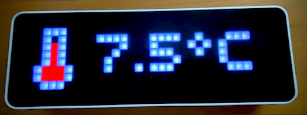
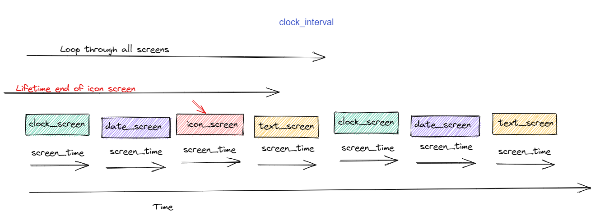
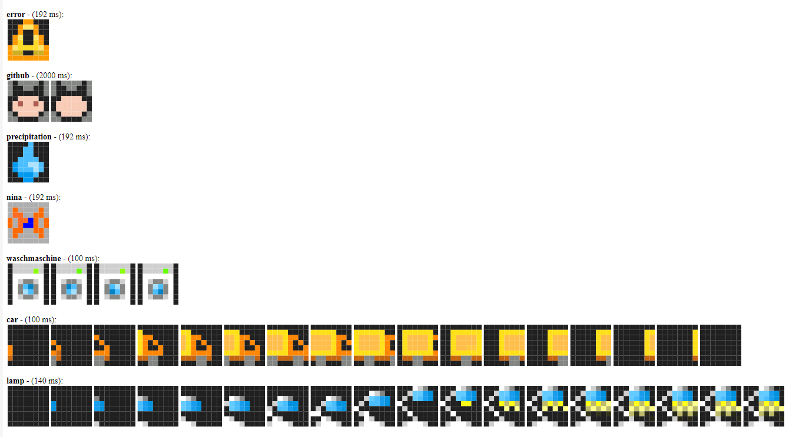
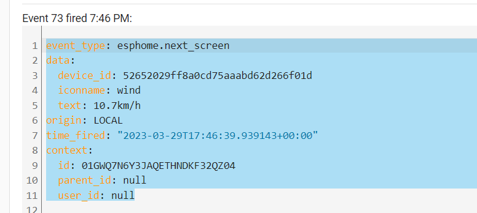

# EspHoMaTriX version 2 (EHMTXv2)

[donation-badge]:https://img.shields.io/badge/PayPal-00457C?style=for-the-badge&logo=paypal&logoColor=white
[donation-url]: https://www.paypal.com/donate/?hosted_button_id=FZDKSLQ46HJTU


[![Donate][donation-badge]][donation-url]

## Important information

If you like this project, please donate a star on GitHub and consider [sponsoring](https://www.paypal.com/donate/?hosted_button_id=FZDKSLQ46HJTU) me!

## Introduction

An easy to setup and extensible DIY LED Matrix status display built with a 8x32 RGB LED panel, (Example: ULANZI TC001) all implemented with [esphome.io](https://esphome.io)



If you like to cuztomize and tinker you can use this custom component as a satellite voice control microphone for home assistant. [Youtube](https://www.youtube.com/watch?v=CsOir14DCbM)

For additioanl tips and tricks be sure to check out the [WIKI](https://github.com/lubeda/EspHoMaTriXv2/wiki)

## Background

There are some “RGB-matrices” status displays/clocks out there, the commercial ones from LaMetric and Ulanzi, also some excellent DIY-alternatives.

- [LaMetric](https://lametric.com/en-US/) commercial ~ €199
- [Ulanzi TC001](https://www.aliexpress.com/item/1005005008682055.html) commercial ~ €50
- [AWTRIX](https://awtrixdocs.blueforcer.de/#/) (project has been discontinued after more than 4 years in August 2022)
- [Pixel It](https://pixelit-project.github.io/) (project is under active development)
- [AWTRIX-Light](https://github.com/Blueforcer/awtrix-light) From the developer of AWTRIX, optimized for the Ulanzi TC001 hardware

All of the various solutions have their pros and cons. I tried some and used AWTRIX for a long time, but I found it lacking in a lot of ways (in my opinion,) so I started work on an esphome.io variant. Targeted for an optimized and extensible Home Assistant integration without paid blueprints, MQTT broker requirement, or the need to upload files to the ESP board.

### Features

Based on a 8x32 RGB matrix, it displays a clock, the date and up to 24 other 'screens' provided by Home Assistant. Each screen (value/text) can be associated with a 8x8 bit RGB icon or GIF animation (see [installation](#installation-of-esphomatrixv2-custom-component)). The values/text can be updated or deleted from the display queue. Each screen has a lifetime, if not refreshed in its lifetime, it will disappear. Even 8x32 GIF animations are possible. You can control nearly everything of the component.

### State

After the [v1](https://github.com/lubeda/EsphoMaTrix) component became popular and receieved additonal feature requests it became clear that yhe v1 [v1](https://github.com/lubeda/EsphoMaTrix)code was a bit of a mess. I reworked all of the code and restructured it to hopefully be much more extensible. 
**This software is still heavily in development, before updating please check the [Breaking Changes](#breaking-changes)**

### Advice

It is highly recomended to use an **ESP32 device**. There are conditions where the RAM size is too limited in a **ESO8266 device** so some of the features had to be removed for these boards (Example: bitmap_screen).

## How to use

### The easy way

There is a little hype around the Ulanzi TC001 pixel clock. The easy way works with the Ulanzi TC001 hardware. For more customization and other hardware, look [here](#the-advanced-way).

In easy mode you'll have a clock with auto brightness control and after step 3 you can send states to the display and toggle on or off additional screen elements.

#### Step 1

Copy these files from the source folder `copy2esphome`:

- ulanzi-simple.yaml
- mateine.ttf

to your esphome directory (usually /config/esphome). In your esphome dashboard, you will find a new device named `ulanzi-easy`.

#### Step 2

Connect your Ulanzi device to your host with USB-C and flash the firmware.

#### Step 3

Copy the blueprints `EHMTX_easy_*.yaml` to your blueprint path (usually /config/blueprints/automation/) in a subfolder named `ehmtxv2`.

Reload your automations and have fun after configuring some automations with this blueprint.

### Result

The device should boot


and after a while (~30 seconds) it should display the correct time.

.

If not, check the esphome logs for further investigations.

### The advanced way

This is for the more advanced users. If you understand the concept of esphome, you can display nearly everything with this component. You can also create your own customized esphome based display with multiple sensors, or even use it as a microphone for the new [voice assist](https://esphome.io/components/voice_assistant.html) feature from home assistant.

#### Concept

You can add screens to a queue and all these screens are displayed one after another.

Each screen can display different information or animation or text, even in rainbow color. They all have a lifetime, if a screen isn't refreshed during its lifetime it will be removed from the queue. If there is nothing left in the queue, the date and time screens are displayed. Some screens can show additional features like an alarm or rindicator see [elements](#display-elements).
You can add screens from home assistant with service-calls or from esphome via lambdas in your YAML.

#### Screen types a.k.a. what is possible

##### Date/Time screen


###### Service via API

You can call this from, e.g., the [developer tools service](https://my.home-assistant.io/redirect/developer_services/)

```c
clock_screen => {"lifetime", "screen_time", "default_font", "r", "g", "b"}
rainbow_clock_screen => {"lifetime", "screen_time", "default_font"}
date_screen => {"lifetime", "screen_time", "default_font", "r", "g", "b"}
rainbow_date_screen => {"lifetime", "screen_time", "default_font"}
```

The rainbow_* variants don't display the day of week bar.

###### Lambda

You can use these in [lambdas](https://esphome.io/guides/automations.html?highlight=lambda#lambda-action) in your esphome YAML.

all parameters have a default value.

```c
void clock_screen(int lifetime=D_LIFETIME, int screen_time=D_SCREEN_TIME,bool default_font=true,int r=C_RED, int g=C_GREEN, int b=C_BLUE);
void rainbow_clock_screen(int lifetime=D_LIFETIME, int screen_time=D_SCREEN_TIME, bool default_font=true);
void date_screen(int lifetime=D_LIFETIME, int screen_time=D_SCREEN_TIME,bool default_font=true, int r=C_RED, int g=C_GREEN, int b=C_BLUE);     
```

##### icon screen


###### Service via API

```c
icon_screen => {"icon_name", "text", "lifetime", "screen_time", "default_font", "r", "g", "b"}
rainbow_icon_screen => {"icon_name", "text", "lifetime", "screen_time", "default_font"}
```

###### Lambda

```c
void icon_screen(std::string icon, std::string text, int lifetime=D_LIFETIME, int screen_time=D_SCREEN_TIME,bool default_font=true,int r=C_RED, int g=C_GREEN, int b=C_BLUE);
void rainbow_icon_screen(std::string icon, std::string text, int lifetime=D_LIFETIME, int screen_time=D_SCREEN_TIME,bool default_font=true);
```

##### full_screen

For 8x32 icons or animations


###### service via API

```c
full_screen => {"icon_name", "lifetime", "screen_time"}
```

###### Lambda

```c
void full_screen(string iconname, int =D_LIFETIME, int screen_time=D_SCREEN_TIME);
```

##### bitmap screen

**This feature is only available on ESP32 platform!!!!!**

For 8x32 images as text. You can generate these images with, e.g., [Pixel Bitmap Creator (8x32)](https://pixelit.bastelbunker.de/PixelCreator)

###### service via API

```c
bitmap_screen => {"[0,4523,0,2342,0,..... (256 values 16bit values rgb565)]", "lifetime", "screen_time"}
```

###### Lambda

```c
void bitmap_screen(string text, int =D_LIFETIME, int screen_time=D_SCREEN_TIME);
```

#### Display Elements


##### alarm

The alarm is displayed in the upper-right corner on all screen types! You can set its color and its size.

###### service

```c
show_alarm => { "r", "g", "b","size"}
```

###### API

```c
void EHMTX::show_alarm(int r, int g, int b, int size=2);
```

r, g, b: 0-255 color components
size: 0-3 (zero turns it off)

To remove it, call:

###### Service

```c
hide_alarm => no parameter
```

###### Lambda

```c
void hide_alarm();
```

##### rindicator

The rindicator is in the lower-left corner, but not displayed in full screen 8x32 animations. You can set its color.

###### Service

```c
show_rindicator => { "r", "g", "b","size"}
```

###### API

```c
void show_rindicator(int r, int g, int ,int size=3);
```

r, g, b: 0-255 color components
size: 0-3 (zero turns it off)

To remove it, call:

###### Service

```c
hide_rindicator => no parameter
```

###### Lambda

```c
void hide_rindicator();
```

##### lindicator

Same as above but in the lower-left corner, this is not visible while icons are displayed.

##### gauge

The gauge is displayed in the left most column. You can set its color and its value from 0-100, the resolution is limited to 8 pixels, so it is not a precision gauge.

###### service

```c
show_gauge => {"value","r", "g", "b","bg_r", "bg_g", "bg_b"}
```

###### API

```c
void show_gauge(int percent, int r, int g, int b, int bg_r, int bg_g, int bg_b);
```

percent: 0-100 (resolution: one pixel per 12.5%)
r, g, b: 0-255 foreground color components
bg_r, bg_g, bg_b: 0-255 background color components

To remove it, call:

###### service

```c
hide_gauge => no parameter
```

###### API

```c
void hide_gauge();
```

#### Installation of **EspHoMaTriXv2** custom component

**EspHoMaTriXv2** is a custom component, you have to include it in your YAML configuration. To always use the newest features, you should use the repo, to use a stable version, you copy a working version to your esphome installation.

##### use of local copy

If you download the components-folder from the repo and install it in your esphome you have a stable installation. But if there are new features, you won't see them. If needed, customize the YAML to your folder structure.

```yaml
external_components:
   - source:
       type: local
       path: components # e.g. /config/esphome/components
```

##### use from repo

Use the GitHub repo as a component. Esphome refreshes the external components “only” once a day, perhaps you have to refresh it manually. In this mode, there may be breaking changes, so read the changelog and check the logs while installing the firmware.

```yaml
external_components:
  - source:
      type: git
      url: https://github.com/lubeda/EspHoMaTriXv2
      ref: stable # optional select a special branch or tag
```

#### Addressable_light component

The **EspHoMaTriXv2** component requires a 8x32 pixel addressable_light, it is referenced by the ID `matrix_component`.

See the default [options](https://esphome.io/components/display/index.html)

There are some different matrices-types on the market, to adapt them to **EspHoMaTriXv2** you have to find the proper pixel mapper. If there is garbage on your display, try the other `pixel_mapper`. Here are the most common types for flexible 8x32 matrices:

##### Type 1

Common for 8x32 RGB flexible matrices.

Under the display tag, specify this pixel mapper:

```yaml
display:
  - platform: addressable_light
    .....
    pixel_mapper: |-
      if (x % 2 == 0) {
        return (x * 8) + y;
      }
      return (x * 8) + (7 - y);
    .....
```

##### Type 2 (e.g., Ulanzi TC001)

Under the display tag, specify this pixel mapper:

```yaml
display:
  - platform: addressable_light
    .....
    pixel_mapper: |-
      if (y % 2 == 0) {
        return (y * 32) + x;
      }
      return (y * 32) + (31 - x);
    .....
```

##### Type 3 (daisy-chained 8x8 panels)

```yaml
display:
  - platform: addressable_light
    .....
    pixel_mapper: |-
      return ((int) (x/8 * 64)) + x % 8 + y * 8;
    .....
```

##### How to configure the pixel_mapper

You have to configure this `lambda` under the `display:` section to use the **EspHoMaTriXv2** component

```yaml
display:
  - platform: addressable_light
    id: ehmtx_display
    .....
    auto_clear_enabled: true
    lambda: |-
      id(rgb8x32)->tick();
      id(rgb8x32)->draw();
```

#### Light component

The light component is used by the addressable_light component and referenced by ID under `addressable_light_id:`.

To use the light component directly from home assistant, add the sample lambdas```on_turn_on``` and ```on_turn_off``` to the light component.

***Sample***

```yaml
light:
  - platform: neopixelbus
    id: ehmtx_light
    ....
    on_turn_on:
      lambda: |-
         id(ehmtx_display)->set_enabled(false);
    on_turn_off:
       lambda: |-
         id(ehmtx_display)->set_enabled(true);
```

To hide the light component in home assistant use: `internal: true`

```yaml
light:
  - platform: neopixelbus
    id: ehmtx_light
    internal: true
    ...
```

#### Time component

Since it is a clock, you need a time component, e.g., [home assistant](https://esphome.io/components/time/homeassistant.html). It is referenced by its ID under `time_component:` The display shows `!t!` until the time source is synchronized and valid.

#### Font

In the easy configuration is a TTF-font included, it is based on this [font](https://www.pentacom.jp/pentacom/bitfontmaker2/gallery/?id=13768). Or you can search for a font you like more.

Not all fonts are suitable for this minimalistic display. There are public domain fonts which work well on the display, e.g., [DMDSmall](https://www.pentacom.jp/pentacom/bitfontmaker2/gallery/?id=5993), details on alternative fonts are [here](https://blakadder.com/esphome-pixel-clock/#fonts).

You can configure two fonts if you like.

Trip5 is also providing special fonts for 8x32 matrices in his [repo](https://github.com/trip5/MatrixClockFonts)

dbuezas has also contributed tow optimized fonts with umlauts for this kind of display CalciumThinTall.ttf and CalciumSuperThinTall.ttf. They are included in the copy2esphome folder

```yaml
font:
  - file: mateine.ttf
    id: default_font
    size: 16
    glyphs:  |
      !"%()+*=,-_.:°0123456789ABCDEFGHIJKLMNOPQRSTUVWXYZ abcdefghijklmnopqrstuvwxyz€@
```

#### Icons and Animations

Download and install all needed icons (.jpg/.png) and animations (.GIF) under the `ehmtxv2:` key. All icons have to be 8x8 or 8x32 pixels in size. If necessary, scale them with gimp, check “as animation” for GIFs.

You can also specify a URL to directly download the image file. The URLs will only be downloaded once at compile time, so there is no additional traffic on the hosting website.

The [icons](https://awtrix.blueforcer.de/icons) and [animations](https://awtrix.blueforcer.de/animations) from the AWTRIX and AWTRIX-light could be used, but have to be scaled down to 8x32 or 8x8 pixels. Check the license before using them!

There are maximum 90 icons possible.

***Sample***

```yaml
emhtx:
  icons: 
    - id: boot 
      file: icons/rocket.GIF
      duration: 75     
    - id: temp 
      file: temperature.png
    - id: yoga
      file: icons/yoga-bridge.GIF
      pingpong: true
    - id: jackshome
      url: https://awtrix.blueforcer.de/animations/JackHomePage
      resize: 32x8
    - id: garage
      lameid: 1234
      duration: 100
    - id: homeassistant
      url: https://github.com/home-assistant/assets/raw/master/logo/logo-special.png      
```

The ID of the icons is used later to configure the screens to display. So, you should name them wisely. If you like to group icons, you should prefix them, e.g., with “weather_” (see Service **del_screen**)

The first defined icon will be used as a fallback icon, in case of an error, e.g., if you use a non-existing icon ID.

GIFs are limited to 110 frames to limit the used amount of flash space.

All other solutions provide ready-made icons, especially Lametric has a big database of [icons](https://developer.lametric.com/icons). Please check the copyright of the icons you use. The maximum number of icons is limited to 90 in the code and also by the flash space and the RAM of your board.

See also [icon parameter](#icons)

#### Configuration

##### ehmtxv2 component

This component is highly customizable.

***Example***

```yaml
ehmtxv2:
  id: rgb8x32
  show_seconds: true
  matrix_component: ehmtx_display
  time_component: ehmtx_time
  icons2html: true
  default_font_id: default_font
  default_font_yoffset: 6
  special_font_id: special_font
  special_font_yoffset: 7
  brightness: 80 # percent
  time_format: "%H:%M"
  date_format: "%d.%m."
  rtl: false # write vom left to right
  week_start_monday: true # false equals sunday
  scroll_count: 2 # scroll long text at least two times
  scroll_interval: 80 # milliseconds
  rainbow_interval: 32 # milliseconds
  icons: 
  .....
```

***Parameters***

**id** (required, ID): Manually specify the ID used for code generation and in service definitions.

**date_format** (optional, string): formats the date display with [strftime syntax](https://esphome.io/components/time.html?highlight=strftime), defaults `"%d.%m."` (use `"%m.%d."` for the US)

**show_seconds** (optional, boolean): toggle/blink an indicator-pixel each seconds while the clock is displayed (default: false)

**time_format** (optional, string): formats the date display with [strftime syntax](https://esphome.io/components/time.html?highlight=strftime), defaults `"%H:%M"` (use `"%I:%M%p"` for the US)

**default_font_yoffset** (optional, pixel): yoffset the text is aligned BASELINE_LEFT, the baseline defaults to `6`

**default_font_xoffset** (optional, pixel): xoffset the text is aligned BASELINE_LEFT, the left defaults to `1`

**special_font_yoffset** (optional, pixel): yoffset the text is aligned BASELINE_LEFT, the baseline defaults to `6`

**special_font_xoffset** (optional, pixel): xoffset the text is aligned BASELINE_LEFT, the left defaults to `1`

**scroll_small_text** (optional, bool): normally small text is centered on the display if possible, with this set to `true` even small text is scrolled in `text_screen` and `rainbow_text_screen` (default: false)

**allow_empty_screen** (optional, bool): When the queue for messages to be displayed is empty and the time screen has been removed, the time screen is normally reactivated. This option can be used to disable this behavior by setting `allow_empty_screen` to `true`. (default: false)

**rtl** (optional, boolean): if `true` write text (but only the scroll direction, the words and numbers aren't changed!) from right to left (Arabic, Hebrew etc.). Default is `false`

**matrix_component** (required, ID): ID of the addressable display

**show_date** (optional, bool): show the date in the loop (rainbow and normal), defaults to true.

**show_dow** (optional, bool): draw the day of week rindicator on the bottom of the clock screen. Disable, e.g., if you want larger fonts, defaults to true.

**blend_steps** (optional, int): on screen transition you can blend in the new screen, a value of 16 works nice, defaults 0.

**time_component** (required, ID): ID of the time component. The display shows `!t!` until the time source is valid.

**default_font** (required, ID): ID of the default font

**special_font** (required, ID): ID of the special font, you can reuse your default font, but occasionally, it's nice to have a special font to minimize scrolling

**week_start_monday** (optional, bool): default Monday is first day of week, false => Sunday

**default_clock_font** (optional, boolean): If true, use the default font for clock and date otherwise use the special font. (default = `true`)

**scroll_interval** (optional, ms): the interval in ms to scroll the text (default=80), should be a multiple of the ```update_interval``` of the [display](https://esphome.io/components/display/addressable_light.html)

**clock_interval** (optional, s): the interval in seconds to force the clock display. By default, the clock screen, if any, will be displayed according to the position in the queue. **If you set the clock_interval close to the screen_time of the clock, you will only see the clock!** (default=0)

**boot_logo** (optional, string , only on ESP32): Display a fullscreen logo defined as rgb565 array.

```yaml
  boot_logo: "[0,0,0,0,0,0,0,0,0,0,0,0,0,0,0,0,0,0,0,0,0,0,0,0,0,0,0,0,0,0,0,0,0,63519,63519,63519,63519,0,0,0,0,0,0,0,0,0,0,0,0,0,0,0,0,0,0,0,0,0,0,0,0,0,0,0,0,63519,0,0,0,0,2016,0,0,0,0,0,0,0,0,0,0,31,0,0,0,0,0,0,0,0,0,63488,0,63488,0,0,0,63519,0,0,0,0,2016,2016,0,0,0,65514,0,65514,0,0,0,31,0,0,0,64512,0,0,64512,0,63488,63488,0,63488,63488,0,0,63519,63519,63519,0,0,2016,0,2016,0,65514,0,65514,0,65514,0,31,31,31,0,0,0,64512,64512,0,0,63488,63488,63488,63488,63488,0,0,63519,0,0,0,0,2016,0,2016,0,65514,0,65514,0,65514,0,0,31,0,0,0,0,64512,64512,0,0,0,63488,63488,63488,0,0,0,63519,63519,63519,63519,0,2016,0,2016,0,65514,0,65514,0,65514,0,0,0,31,31,0,64512,0,0,64512,0,0,0,63488,0,0,0,0,0,0,0,0,0,0,0,0,0,0,0,0,0,0,0,0,0,0,0,0,0,0,0,0,0,0,0,0,0,0,0]" 
```

If defined you can use the services `display_boot_logo` and `display_version` to display the defined logo or the version of ehmtx.

**icons2html** (optional, boolean): If true, generate the HTML-file (*filename*.html) to show all included icons.  (default = `false`)

**always_show_rl_indicators** (optional, boolean): If true, always show the r/l indicators on all screens. Default is to not show either on clock, date, full, and bitmap screens, left on icon, or if display gauge displayed. (default = `false`)

***Example output:***


### icons

***Parameters***
See [icon details](#icons-and-animations)

- **frame_duration** (optional, ms): in the case of a GIF-file, the component tries to read the default interval for each frame. The default/fallback interval is 192 ms. In case you need to override the default value, set the duration per icon.
- **pingpong** (optional, boolean): in the case of a GIF-file, you can reverse the frames instead of starting from the first frame.

- **file** (Exclusive, filename): a local filename
- **url** (Exclusive, url): a URL to download the icon
- **lameid** (Exclusive, number): the ID from the LaMetric icon database

- **resize** (Optional, "8x8" or "32x8"): If the source file hasn't the right dimensions.

***Example***

```yaml
    - id: jackshome
      url: https://awtrix.blueforcer.de/animations/JackHomePage
      resize: 32x8
```

## Control your display

Numerous features are accessible with services from home assistant and lambdas that you can use in your YAML.

### Public functions/services
  
|service|parameter|result|
|---|---|---|
|`get_status`|none|write some status information to the esphome logs|
|`display_on`|none|turn display off|
|`display_off`|none|turn display on|
|`hold_screen`|none|show the screen that is currently displayed for the number of seconds longer|
|`hide_rindicator`|none|hides the rindicator|
|`hide_gauge`|none|hides the gauge|
|`hide_alarm`|none|hides the alarm|
|`show_gauge"`|"percent", "r", "g", "b"|set the height of the gauge according to the percentage in the given color|
|`show_alarm`|"r", "g", "b", "size"|shows the color with the given size in the upper-right corner|
|`show_rindicator`|"r", "g", "b", "size"|shows the color with the given size in the lower-right corner|
|`set_clock_color`|"r", "g", "b"|set the default color for the clock/date display|
|`set_today_color`|"r", "g", "b"|set the special color for today in the day of week line|
|`set_weekday_color`|"r", "g", "b"|set the default color in the day of week line|
|`del_screen`|"icon_name", “mode”|deletes the specified icon screen from the queue, the [mode](#modes) is a filter|
|`force_screen`|"icon_name", “mode”|displays the selected the specified icon screen from the queue, the [mode](#modes) is a filter|
|`full_screen`|"icon_name", "lifetime", "screen_time"|show the specified 8x32 icon as full screen|
|`icon_screen`|"icon_name", "text", "lifetime", "screen_time", "default_font", "r", "g", "b"|show the specified icon with text|
|`rainbow_icon_screen`|"icon_name", "text", "lifetime", "screen_time", "default_font"|show the specified icon with text in rainbow color|
|`text_screen`|"text", "lifetime", "screen_time", "default_font", "r", "g", "b"|show the specified text|
|`rainbow_text_screen`|"text", "lifetime", "screen_time", "default_font"|show the specified text in rainbow colors|
|`clock_screen`|"lifetime", "screen_time", "default_font", "r", "g", "b"|show the clock|
|`rainbow_clock_screen`|"lifetime", "screen_time", "default_font"|show the clock in rainbow color|
|`blank_screen`|"lifetime", "screen_time"|"show" an empty screen|
|`date_screen`|"lifetime", "screen_time", "default_font", "r", "g", "b"|show the date|
|`brightness`|"value"|set the display brightness|

#### Parameter description

"r", "g", "b": Color components for red, green, and blue 0..255
"size": The size of the rindicator or alarm, 1-3
"percent": values from 0..100
"icon_name": the id of the icon to show, as defined in the YAML file
"text": a text message to display
"lifetime": how long does this screen stay in the queue (minutes)
"screen_time": how long is this screen display in the loop (seconds). For short text without scrolling it is shown the defined time, longer text is scrolled at least `scroll_count` times.
"default_font": use the default font (true) or the special font (false)
"value": the brightness 0..255 

### Local lambdas

#### Add screen to your display queue

You can add screens locally and display data directly from any local sensor. See this sample:

##### Lambda

Take care that the ```char text[30];``` has enough space to store the formatted text.

```yaml
sensor:
  - platform: bh1750
    id: sensorlx
    ...
    on_value:
      then:
        lambda: |-
          char text[30];
          sprintf(text,"Light: %2.1f lx", id(sensorlx).state);
          // 5 Minutes,each time at least 11 seconds,no alarm
           id(rgb8x32)->icon_screen("sun", text); // uses default values for color etc.
```

##### Force screen

Force the selected [icon_screen](#icon-screen) ```icon_name``` to be displayed next. Afterward, the loop continues from this screen. e.g., helpful for alarms. Or after an update of the value/text.

```yaml
    id(rgb8x32)->force_screen("homeassistant");
```

##### Change configuration during runtime

*Configuration variables/functions:*

Experienced programmers can use these public methods:

```c
```

### Local triggers

To use the display without home assistant automations, you may use the [advanced functionality](#change-configuration-during-runtime) with triggers. The triggers can be fired by sensors, time or by the ehmtxv2 component.

#### on_add_screen

There is a trigger available to do some local magic. The trigger ```on_add_screen``` is triggered every time a new screen with an icon is added to the queue. In lambda's you can use two local variables:

**icon** (Name of the icon, std::string): value to use in lambda

**mode** ([mode](#modes) of the screen, uint8_t): value to use in lambda

See the examples:

##### Write information to esphome log

```yaml
ehmtxv2:
  ....
    on_add_screen:
    then:  
      - logger.log:
          format: 'add screen: %s, mode: %d'
          tag: "EHMTXv2 sample"
          args:
            - icon.c_str()
            - mode
```

#### on_start_running

The trigger ```on_start_running``` is triggered when the display starts. It is triggered when time sync is done, and initial clock / date / version screens are loaded. This is to allow you to customize the default screens (for instance set colours for the clock).

#### on_icon_error

The trigger ```on_icon_error``` is triggered if you try to add a screen with a non defined icon. In lambda's you can use one local string variable:

**icon** (Name of the icon, std::string): value to use in lambda

See the examples:

```yaml
ehmtxv2:
  ....
  on_next_screen:
    lambda: |-
        ESP_LOGD("Check CONFIG","Iconname: %s",icon.c_str());
```

#### on_next_screen

The trigger ```on_next_screen``` is triggered every time a new screen is displayed (it doesn't trigger on the clock/date display!!). In lambda's you can use two local string variables:

**icon** (Name of the icon, std::string): value to use in lambda

**text** (displayed text, std::string): value to use in lambda

See the examples:

##### Write information to esphome log

```yaml
ehmtxv2:
  ....
  on_next_screen:
    lambda: |-
        ESP_LOGD("TriggerTest","Iconname: %s",icon.c_str());
        ESP_LOGI("TriggerTest","Text: %s",text.c_str());
```

##### Send an event to Home Assistant

To send data back to home assistant, you can use events.

```yaml
ehmtxv2:
  ....
  on_next_screen:
    - homeassistant.event:
        event: esphome.next_screen
        data_template:
          iconname: !lambda "return icon.c_str();"
          text: !lambda "return text.c_str();"
```

***Result***



#### on_next_clock

The trigger ```on_next_clock``` is triggered every time a new clock display circle starts.
See the examples:

##### Change something for each clock circle

```yaml
ehmtxv2:
  ....
  on_next_clock:
    lambda: |-
      id(rgb8x32)->.......
```

**(D)** Service **brightness**

Sets the overall brightness of the display (`0..255`)

*parameters:*

- ```brightness```: from dark to bright (`0..255`) (default = `80`) as set in the light component by ```color_correct: [30%, 30%, 30%]```

There's an easier way, by using a number component:

```yaml
number:
  - platform: template
    name: "LED brightness"
    min_value: 0
    max_value: 255
    step: 1
    lambda: |-
      return id(rgb8x32)->get_brightness();
    set_action:
      lambda: |-
        id(rgb8x32)->set_brightness(x);
```

**(D)** Service **del_screen**

Removes a screen from the display by icon name. If this screen is actually displayed while sending this command, the screen will be displayed until its "show_screen"-time has ended.

Optionally, you can suffix a * to the icon name to perform a wildcard delete, which will delete all screens beginning with the icon_name specified.

For example, if you have multiple icons named weather_sunny, weather_rain & weather_cloudy, you can issue a del_screen weather_* to remove whichever screen is currently in a slot and replace it with a new weather screen.

*Parameters:*

- ```icon_name```: Icon `id` defined in the YAML (see installation)
- ```mode```: The mode is a filter to select different screen types e. g. use `5`for icon_screen

##### modes

|mode|value|
|----|----|
|MODE_BLANK|1|
|MODE_CLOCK | 2|
|MODE_DATE | 3|
|MODE_FULL_SCREEN| 4|
|MODE_ICON_SCREEN| 5|
|MODE_TEXT_SCREEN| 6|
|MODE_RAINBOW_ICON| 7|
|MODE_RAINBOW_TEXT|8|
|MODE_RAINBOW_CLOCK| 9|
|MODE_RAINBOW_DATE| 10|
|MODE_BITMAP_SCREEN| 11|
|MODE_BITMAP_SMALL| 12|

**(D)** Service **display_on** / **display_off**

Turns the display on or off

There's an easier way in using a switch component:

***Sample***

```yaml
switch:
  - platform: template
    name: "$devicename Display"
    icon: "mdi:power"
    restore_mode: ALWAYS_ON
    lambda: |-
      return id(rgb8x32)->show_display;
    turn_on_action:
      lambda: |-
        id(rgb8x32)->set_display_on();
    turn_off_action:
      lambda: |-
        id(rgb8x32)->set_display_off();
```

Service **skip_screen**

If there is more than one screen in the queue, it skips the actual displayed screen to the next screen.

e.g., on the Ulanzi TC001

```yaml
binary_sensor:
  - platform: gpio
    pin:
      number: $left_button_pin
      inverted: true
    on_press:
      lambda:
        id(rgb8x32)->skip_screen();
```

Service **hold_screen**

Displays the current screen for a configured amount (default=30) seconds longer.

e.g., on the Ulanzi TC001

```yaml
binary_sensor:
  - platform: gpio
    pin:
      number: $right_button_pin
      inverted: true
    on_press:
      lambda:
        id(rgb8x32)->hold_screen(120);
```

**(D)** Service **get_status**

This service displays the running queue and a list of icons in the logs

```log
[13:10:10][I][EHMTX:175]: status status: 1  as: 1
[13:10:10][I][EHMTX:176]: status screen count: 3
[13:10:10][I][EHMTX:181]: status slot: 0 icon: 36  text: 47.9°C end: 400
[13:10:10][I][EHMTX:181]: status slot: 1 icon: 23  text: Supa langer Text end: 310
[13:10:10][I][EHMTX:181]: status slot: 2 icon: 1  text: 10.3°C end: 363
[13:10:10][I][EHMTX:186]: status icon: 0 name: boot
[13:10:10][I][EHMTX:186]: status icon: 1 name: temp
[13:10:10][I][EHMTX:186]: status icon: 2 name: garage
[13:10:10][I][EHMTX:186]: status icon: 3 name: wind
[13:10:10][I][EHMTX:186]: status icon: 4 name: rain
```

## Integration in Home Assistant

To control your display, it has to be integrated in Home Assistant. Then it provides several services, all prefixed with the configured `devicename` e.g.,, "ehmtx". See the default services marked as **(D)** [above](#services), but you can add your own (see alarm and screen).

### Services

All communication with Home Assistant use the homeasistant-api. The services can be provided by default or also defined additionally in the YAML. To define the additional services, you need the id of the ehmtx-component e.g. ```id(rgb8x32)```.

### Use in Home Assistant automations

The easiest way to use ehmtx as a status display is to use the icon names as trigger id. In my example, I have an icon named “wind” when the sensor.wind_speed has a new state, this automation sends the new data to the screen with the icon named “wind” and so on.

```yaml
alias: EHMTX 8266 Test
description: ''
trigger:
  - platform: numeric_state
    entity_id: sensor.wind_speed
    id: wind
  - platform: state
    entity_id: sensor.actual_temperature
    id: temp
  - platform: state
    entity_id: sensor.wg_cover_device
    id: cover
condition: []
action:
  - service: esphome.ehmtx8266_icon_screen
    data:
      icon_name: '{{trigger.id}}'
      text: >-
        {{trigger.to_state.state}}{{trigger.to_state.attributes.unit_of_measurement}}
mode: queued
max: 10
```

## Tips

### Display sensor precision after home assistant 2023.3.0

See [templating](https://www.home-assistant.io/docs/configuration/templating/#states) for possibilities to optimize the output
e.g.
```{{ states(sensor.solarpower, rounded=True) }} kWh```

### Specific icons per condition

Add an icon per weather condition to the ehmtxv2 component

```yaml
  - id: weather_clear_night
      lameid: 52163
    - id: weather_cloudy
      lameid: 25991
    - id: weather_fog
      lameid: 52167
    ......
```

Sample automation to show the weather with local temperature

```yaml
alias: EHMTX weather
description: weather with icon per condition
trigger:
  - platform: state
    entity_id: weather.metno
action:
  - service: esphome.ulanzi_del_screen
    data:
      icon_name: weather_*
      mode: 5
  - service: esphome.ulanzi_icon_screen
    data:
      icon_name: weather_{{ trigger.to_state.state }}
      text: >-
        {{ states("sensor.external_actual_temperature") }}°C
      ....
```

or another sample automation for the trashcan type

```yaml
alias: "EHMTX Müllanzeige"
description: Anzeige welche Tonne raus muss. iconnamen gekürzt
trigger:
  - platform: time
    at:
      - "06:30"
      - "08:30"
      - "10:30"
      - "15:00"
      - "17:00"
      - "19:00"
condition:
  - condition: numeric_state
    entity_id: sensor.mulltrigger
    below: "3"
action:
  - service: esphome.ulanzi_del_screen
    data:
      icon_name: trash_*
      mode: 5
  - service: esphome.ulanzi_icon_screen
    data:
      icon_name: >-
        trash_{{ states("sensor.mulldetails") | replace("Biotonne",   "brow")|
        replace("Papiertonne","blue")| replace("Restmüll",   "grey")|
        replace("gelbe Tonne","yell|") | truncate(4,true,"")  }}     
      text: >-
        {{ states("sensor.mulldetails")|replace(" in","")|replace(" days","
        Tagen") | replace ("0 Tagen","heute") | replace ("1 Tagen","morgen")}}
      lifetime: 120
      ...
```

### Integrate into Home Assistant UI

Add entities to the Home Assistant UI for interactive control of the display

#### Brightness

```yaml
number:
  - platform: template
    name: "$devicename brightness"
    min_value: 0
    max_value: 255
    step: 1
    lambda: |-
      return id(rgb8x32)->get_brightness();
    set_action:
      lambda: |-
        id(rgb8x32)->set_brightness(x);
```

#### Display switch

```yaml
switch:
  - platform: template
    name: "$devicename Display"
    icon: "mdi:power"
    restore_mode: ALWAYS_ON
    lambda: |-
      return id(rgb8x32)->show_display;
    turn_on_action:
      lambda: |-
        id(rgb8x32)->set_display_on();
    turn_off_action:
      lambda: |-
        id(rgb8x32)->set_display_off();
```

### automatic brightness

Awtrix and PixelIt have hard-coded functionality. EHMTX is also capable of building something like that with lambdas. Feel free to expierement as you see fit. See the Ulanzi simple YAML as a guide.

Example: automatic brightness control with a bh1570 sensor

```yaml
sensor:
  - platform: bh1570
    # ...
    on_value:
      then:
         lambda: |-  
            if (x > 200)
            {
               id(rgb8x32)->set_brightness(50);
            } else {
               id(rgb8x32)->set_brightness(250);
            }
```

## Breaking changes

### 2023.7.0

- removed automatic boot logo display

### 2023.6.3

**Due to this change these values are fixed, e.g. you can not change the date or timeformat during runtime anymore!!**

- changed *_interval to be set only on compile time
- change scroll_count to be set only on compile time
- change font_offsets to be set only on compile time
- change date/time_format to be set only on compile time

### 2023.5.0

- renamed `indicator` to `rindicator` because there is now also a `lindicator`

## EspHoMaTriX in the media

See this German tutorial video with information on setting up your display [RGB-LED Status Display für Home Assistant mit ESPHome | ESPHoMaTrix](https://www.youtube.com/watch?v=DTd9vAhet9A).

Another german tutorial video focused on the Ulanzi [Smarte Pixel Clock über Home Assistant steuern - Entitäten / Icons und mehr in der Ulanzi](https://www.youtube.com/watch?v=LgaT0mNbl34)

See this [nice article](https://blakadder.com/esphome-pixel-clock/) about EsphoMaTrix on a Ulanzi TC001 from [blakadder](https://github.com/blakadder).

Short video on Instagram [@blak_adder](https://www.insbuiltagram.com/reel/CpYVByRIaSI)

See these english discussions:
[Share your projects](https://community.home-assistant.io/t/esphomatrix-a-simple-clock-status-display/425325)
[ESPHOME](https://community.home-assistant.io/t/a-simple-diy-status-display-with-an-8x32-rgb-led/379051)

It was also mentioned in the blog [Building the Open Home](https://building.open-home.io/local-control-is-the-only-way/) and in the home assistant [livestream](https://youtu.be/IGnCGDaXR0M?t=6267)

Or in German:
[Showroom](https://community.simon42.com/t/8x32-pixel-uhr-mit-homeassistant-anbindung/1076)

## Disclaimer

THE SOFTWARE IS PROVIDED “AS IS”, use at your own risk!

## Thanks

- **[blakadder](https://github.com/blakadder)** for his contribution (cleanup README.md, fixed sample)
- **[dbuezas](https://github.com/dbuezas)** for his fonts [infos](https://github.com/lubeda/EspHoMaTriXv2/issues/63)
- **[andrew-codechimp](https://github.com/andrew-codechimp)** for his contribution (display on/off & del_screen "*" & show_clock with 0) and improved blueprint slelection
- **[jd1](https://github.com/jd1)** for his contributions
- **[aptonline](https://github.com/aptonline)** for his work on the Ulanzi hardware
- **[wsbtak](https://github.com/wsbtak)** for the work on the Ulanzi hardware
- **[ofirsnb](https://github.com/ofirsnb)** for his contributions
- **[trip5](https://github.com/trip5/MatrixClockFonts)** for his work on optimized fonts and user support and work on the wiki
- **[pplucky](https://user-images.githubusercontent.com/16407309/224850723-634c9b2d-55d9-44f2-9f93-765c0485b090.GIF)** for his 8x32 GIF animation
- **[dennisse](https://github.com/dennisse)** Auto brightness for the Ulanzi
- **[hco](https://github.com/hco)** fixing documentation
- **[geekofweek](https://github.com/geekofweek)** fixed sample YAML, cleanup documentation
- **[joncar](https://github.com/joncar)** fixed scroll small text
- **Everybody** who found bugs/issues and reported them!

## Special thanks to all sponsors
